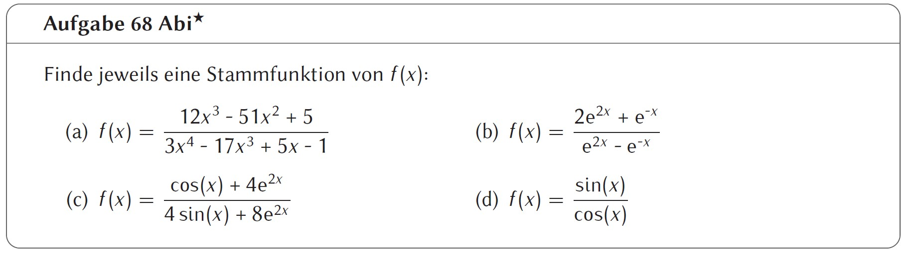
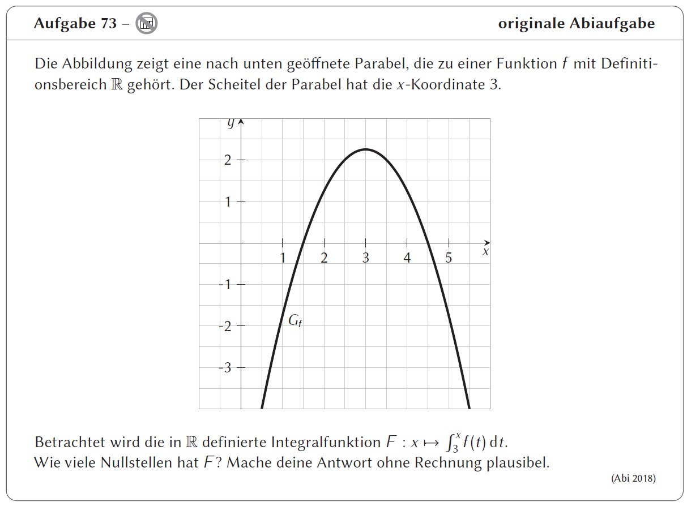

# Analysis Teil 2
- Integration
- Flächeninhalte
- Integralfunktion
- Uneigentliche Integrale
- Umkehrfunktionen

---
<!--header: Analysis | Integration-->
<!--footer: Abiturma Abivorbereitungskurs | Fasching 2023 München | Vinzenz Männig-->
### Integration
- Eine Funktion $F$ ist eine Stammfunktion einer Funktion $f$, wenn gilt: $F^\prime(x) = f(x)$
- Eine Stammfunktion ist bis auf eine Konstante *C* eindeutig (diese fällt beim Ableiten weg)
- Wenn Nachgewiesen werden soll, dass eine Funktion $F$ Stammfunktion einer anderen Funktion $f$ ist, ist es immer einfache $F$ abzuleiten als $f$ zu integrieren
- Unbestimmtes Integral (Gegenstück von Ableitung):
$\int f(x) dx = F(x) + C$
- Um zu testen, ob ein Integral richtig gerechnet wurde, zum Test Ableiten
- Vor dem Integrieren ausmultiplizieren! Produkte können nicht integriert werden

---
##### Integrationsregeln
| $f(x)$ | $x^n, n \neq -1$ | $\mathrm e ^x$ | $\sin x$ | $\cos x$ | $\frac{1}{x} = x^{-1}$ |
| --- | --- | --- | --- | --- | --- |
| $F(x)$ | $\frac{1}{n+1}x^{n+1}$ | $\mathrm e ^x$ | $-\cos x$ | $\sin x$ | $ln \|x\|$ |

$f(x) = 10x^4+3x^2$
&nbsp;
&nbsp;
&nbsp;
$g(x) = \frac{1}{2\sqrt x} - 5\sin x$

---
##### Lineare Substitution
$f(x)=g(mx+c) \quad \implies \quad F(x)= \frac{1}{m}G(mx+c)$

$f(x) = \mathrm e ^{-3x+2}$
&nbsp;
&nbsp;
&nbsp;
&nbsp;
$g(x) = \sqrt{4x-3}$

---
##### Logarithmische Substitution
$f(x) = a \cdot \frac{g^\prime(x)}{g(x)} \quad \implies \quad F(x) = a \cdot \ln(g(x))$

$f(x) = \frac{4x-3}{2x^2-3x+1}$
&nbsp;
&nbsp;
&nbsp;
&nbsp;
$g(x)= \frac{4 \mathrm e^{2x}+6}{\mathrm e^{2x}+3x-1}$

---
### Integration: Rechenblock 1

| Schwierigkeit | Aufgaben |
| ----------- | ----------- |
| leicht | 64, 66 |
| mittel | 63, 67, 68 |
| schwer | 65 |

Für Schnelle und Unterforderte:
- Aufgabe 87 ff.

---

---

---
<!--header: Analysis | Integration: Flächeninhalt-->
### Flächeninhalte
##### Flächeninhalt unter einem Graphen
- Bestimmtes Integral $\int \limits_a^b f(x) dx$
drückt den Flächeninhalt zwischen Graphen und x-Achse aus. Positive Flächen sind über der x-Achse, negative darunter.
- $A = \int \limits_a^b f(x) dx = [F(x)]_a^b = F(b) - F(a)$
- Bei Flächeninhalt unter Graphen von Nullstelle zu Nullstelle integrieren

---
##### Rezept mit Beispiel
$f(x) = \frac{1}{2}x^2-2$
1. Nullstellen berechnen
$f(x) = \frac{1}{2}x^2-2 = 0 \implies x_1 = -2, x_2 = 2$
2. Einzeln von Nullstelle zu Nullstelle integrieren

---
##### Flächeninhalt zwischen zwei Graphen
- $A = |\int \limits_a^b (f(x)-g(x)) dx|$
- Erst die beiden Funktionen verrechnen, dann integrieren
- Welche Funktion von welcher abgezogen wird, ist egal solange am Ende der Betrag genommen wird
- Bei Flächeninhalt zwischen Graphen von Schnittpunkt zu Schnittpunkt integrieren

---
##### Rezept mit Beispiel
$f(x)=-x^2+4x, \quad g(x) = x^2-2x$
1. Schnittpunkte durch gleichsetzen finden
$-x^2+4x = x^2-2x \implies x_1 = 0, x_2 = 3$
2. Einzeln von Schnittpunkt zu Schnittpunkt integrieren

---
<!--header: Analysis | Integration: Rotationskörper-->
### Rotationskörper
Lässt man eine Funktion $f(x)$ im Bereich $[a; b]$ um die x-Achse rotieren entsteht ein Rotationskörper. Für das Volumen V des Rotationskörpers gilt:
$V= \pi \int \limits_a^b (f(x))^2 dx$

##### Rezept mit Beispiel
$f(x) = x^2 + 1$ um die x-Achse im Intervall $[-1; 1]$
$V = \pi \int \limits_{-1}^1 (x^2 + 1)^2 dx = \pi \int \limits_{-1}^1 (x^4+2x^2+1) dx=$
$\pi\left[\frac{1}{5}x^5+\frac{2}{3}x^3+x \right]_{-1}^1 = \pi\left(\frac{1}{5}+\frac{2}{3}+1-\left(-\frac{1}{5}-\frac{2}{3}-1 \right) \right) = \frac{56}{15}\pi$

---
### Integration: Rechenblock 2

| Schwierigkeit | Aufgaben |
| ----------- | ----------- |
| leicht | 70 |
| mittel | 71a, 74, 75 |
| schwer | 72 |

Für Schnelle und Unterforderte:
- Aufgabe 87 ff.
- Aufgaben vom Extrablatt zu Rotationskörpern
---

---

---
<!--header: Analysis | Integration: Integralfunktion-->
### Integralfunktion
$f(x) = \int \limits_1^x g(t) dt$
- Ein Integral mit variabler oberer oder unterer Grenze heißt Integralfunktion.
- Das Integral berechnet hier keinen Flächeninhalt mit gegebenen Grenzen, sondern beantwortet die Frage: "Wie weit muss ich integrieren, um einen bestimmten Flächeninhalt einzuschließen?"

---
##### Rezept mit Beispiel
$f(x) = \int \limits_2^x(2t+4)dt, x>2$, gewünschter Flächeninhalt: 9
Bonus: Es gilt $f(2) = 0$, Warum?
1. Integral ausformulieren
$f(x) = \int \limits_2^x(2t+4)dt = [t^2+4t]_2^x = x^2+4x-(2^2+4 \cdot 2)=$
= $x^2+4x-12$
2. Integral mit dem gewünschten Flächeninhalt gleichsetzen
$x^2+4x-12 = 9 \implies x_1 = -7, x_2 = 3$
Obere Grenze ist somit $x=3$

---

---
<!--header: Analysis | Integration: Uneigentliche Integrale-->
### Uneigentliche Integrale
- Eine Fläche kann ins Unendliche reichen und dennoch endlichen Flächeninhalt besitzen. Das heißt dann uneigentliches Integral.

$f(x)= \mathrm e ^{-x}$, Bestimme Fläche unter Graphen für $x \geq 0$
1. Integral mit einer variablen Grenze aufstellen
$A(z) = \int \limits_0^z \mathrm e^{-x}dx = [- \mathrm e^{-x}]_0^z = -\mathrm e^{-z}+1$
2. Grenzwertbetrachtung
$A(+\infty) = \lim \limits_{z \to \infty} A(z) = \lim \limits_{z \to \infty} -\mathrm e^{-z}+1 = \lim \limits_{z \to \infty} -\frac{1}{\mathrm e^{z}}+1 =$
$= \lim \limits_{z \to \infty} -0+1 = 1$

---
### Integration: Rechenblock 3

| Schwierigkeit | Aufgaben |
| ----------- | ----------- |
| leicht |  |
| mittel |  |
| schwer | 76 |

- Aufgaben vom Extrablatt zu Integralfunktionen

Für Schnelle und Unterforderte:
- Aufgabe 87 ff.
---

---

---
<!--header: Analysis | Umkehrfunktionen-->
### Umkehrfunktionen

##### Definitions- und Wertemenge

- Die Wertemenge $\mathcal W$ ist die Menge aller Zahlen, die aus einer Funktion rauskommen können
- Die Wertemenge wird begrenzt durch das Verhalten im Unendlichen und Extrempunkte
$f(x) = \mathrm e^x, \quad g(x) = -x^2+4$

---
##### Bestimmmung Wertemenge mit Rezept
$f(x) = -x^2+4$

1. Verhalten im unendlichen und Extremstellen finden
$\lim \limits_{x \to \pm \infty} f(x) = -\infty$
$f^\prime(x) = -2x \implies HP(0|4)$
2. Alle dazwischen befindlichen Werte angeben
$\mathcal W_f = ]-\infty, 4]$

---
##### Was ist eine Umkehrfunktion?
- Im Koordinatensystem sind die Graphen an der 45° Grad Linie gespiegelt
$f(x) = \ln x, \quad g(x) = \mathrm e^x$

---
- $g(x)$ ist Umkehrfunktion vom $f(x)$ wenn $g(f(x)) = x$ und $f(g(x)) = x$ gilt (heben sich auf)
- Für Werte- und Definitionsmengen gilt: $\mathcal D_f = \mathcal W_g$ und $\mathcal W_f = \mathcal D_g$, sie werden also getauscht
- Somit kann man die Wertemenge einer Funktion auf durch die Definitionsmenge der Umkehrfunktion bestimmen (ist aber sehr umständlich)
- Funktionen sind nur auf Intervallen umkehrbar, in denen sie entweder nur streng monoton fallend oder nur streng monoton steigend sind! Denn: Jedem y-Wert muss hierbei genau ein x-Wert zugeordnet werden, somit können Funktionen, die für einen y-Wert mehrere x-Werte haben nicht umgekehrt werden!

---
##### Rezept mit Beispiel: Umkehren
$f(x) = 2\sqrt{x-1}+4 = 2(x-1)^{\frac{1}{2}}+4$
1. Monotonie überprüfen
$f^\prime(x) = (x-1)^{-\frac{1}{2}} = 0 \implies$ Keine Lösung, umkehrbar
2. *x* und *y* vertauschen
$x = 2\sqrt{y-1}+4$
3. Nach *y* auflösen
$x = 2\sqrt{y-1}+4 \qquad |-4$
$x-4 = 2\sqrt{y-1} \qquad |:2$
$\frac{x-4}{2} = \sqrt{y-1} \qquad |()^2$
$(\frac{x-4}{2})^2 = y-1 \qquad |+1$
$y = (\frac{x-4}{2})^2 +1$

---
4. y durch $f^{-1}(x)$ ersetzen
$f^{-1}(x) = (\frac{x-4}{2})^2 +1$
5. Neuen Definitionsbereich überprüfen
Ausmultiplizieren: $f^{-1} = \frac{1}{4}x^2-2x+5$
Keine Ausnahmen $\implies \mathcal D = \mathbb R$

---
### Umkehrfunktion: Rechenblock

| Schwierigkeit | Aufgaben |
| ----------- | ----------- |
| leicht |  |
| mittel | 86 |
| schwer |  |

Für Schnelle und Unterforderte:
- Wertemengen von: $f(x) = \mathrm e^x +4, \quad g(x)= 3x^2-2$
$h(x) = \sqrt{x-4}-1, \quad i(x)= \frac{1}{x}, \quad j(x)=\frac{1}{(x-2)^2}$
- Aufgabe 87 ff.
---
Lösungen der Wertemengen:
$f(x) = \mathrm e^x +4 \implies \mathcal W=]4,+\infty[$
$g(x)= 3x^2-2 \implies \mathcal W=[-2],+\infty[$
$h(x) = \sqrt{x-4}-1 \implies \mathcal W=[-1],+\infty[$
$i(x)= \frac{1}{x} \implies \mathcal W=\mathbb R \setminus\{0\}$
$j(x)=\frac{1}{(x-2)^2} \implies \mathcal W=\mathbb R^+$

---

---