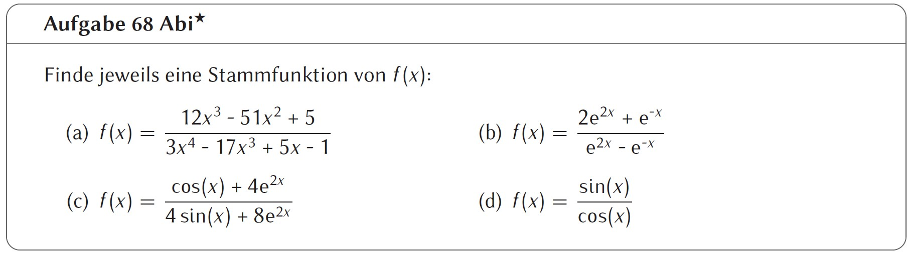

<!--header: Analysis | Extremwertaufgaben-->
<!--footer: Abiturma Abivorbereitungskurs | Winter 2023 München | Vinzenz Männig-->
### Extremwertaufgaben
TODO

---
### Steckbriefaufgaben
TODO

---
### Funktionsscharen
TODO

---
### Wachstumsaufgaben
TODO

---
### Integration: Rechenblock 1

| Schwierigkeit | Aufgaben |
| ----------- | ----------- |
| leicht | 64, 66 |
| mittel | 63, 67, 68 |
| schwer | 65 |

Für Schnelle und Unterforderte:
- Aufgabe 87 ff.

---