# Analysis Teil 1
- Gleichungen
- Grundlagen
- Funktionen
- Nullstellen
- Definitionsmengen
- Änderungsraten und Ableitungen
- Tangentengleichungen
- Extrempunkte und Monotonie
- Wendepunkte
- Verhalten um Unendlichen
- Symmetrie
- Funktionsgraphen zeichnen

---
<!--header: Analysis | Gleichungen-->
<!--footer: Abiturma/Abicrash Abivorbereitungskurs | Fasching 2024 München | Vinzenz Männig-->
## Gleichungen, your turn!
$x^2+x-2=0$
$(x^2-4)(x-3)=0$
$x^4-5x^2-36=0$
$x^4+3x^3=0$

$5e^{2x+1}-3=3e^{2x+1}+1$
$4e^{3x} = 2e^{5x}$
$e^{2x}+e^x=6$

$\sqrt{4x+16}-x-1=0$

$\ln{(x^2-8)}=0$

---
<!--header: Analysis | Grundlagen-->
## Grundlagen
- Binomische Formeln
- Potenzgesetze
- Logarithmengesetze
- Nützliche Umformungen

---
<!--header: Analysis | Grundlagen: Binomische Formeln-->
### Binomische Formeln
1. $(a+b)^2=a^2+2ab+b^2$
2. $(a-b)^2=a^2-2ab+b^2$
3. $(a+b)(a-b)=a^2-b^2$

- Links steht die **Nullstellenform**, rechts die **Polynomform**
- **Nullstellenform**: Gut um Gleichungen zu lösen
- **Polynomform**: Gut zum Ableiten/Integrieren
- Generell gilt: Nur *ausmultiplizieren* wenn umbedingt notwendig!

---
<!--header: Analysis | Grundlagen: Potenzgesetze-->
### Potenzgesetze
1. $\mathrm{e}^a\cdot \mathrm{e}^b=\mathrm{e}^{a+b}$
2. $\frac{\mathrm{e}^a}{\mathrm{e}^b}=\mathrm{e}^{a-b}$
3. $(\mathrm{e}^a)^b=\mathrm{e}^{a\cdot b}$

- Werden fast immer von links nach rechts angewendet
- Funktionieren **nur** bei Mal/Geteilt! Plus/Minus immer nur im Exponenten!
- Nummer 3 wird gerne vergessen
- Alle Regeln gelten natürlich auch mit anderen Basen als *e*

---
##### Beispiele
Mit Basis *x* ...
- $x^2 \cdot x^4 =x^{2+4}=x^6$
- $x^2 \cdot x^{-4} =x^{2-4}=x^{-2}$

... und mit Basis *e* (Erinnerung: $\mathrm{e} \approx 2.718$ ist eine Zahl)
- $\mathrm{e}^2 \cdot \mathrm{e}^4=\mathrm{e}^{2+4}=\mathrm{e}^6 \approx 403$
- $\mathrm{e}^{2 x} \cdot \mathrm{e}^{4 x}=\mathrm{e}^{2 x+4 x}=\mathrm{e}^{6 x}$
- $(\mathrm{e}^2)^3 = \mathrm{e}^{2 \cdot 3} = \mathrm{e}^8 \approx 2981$

---
##### Fallstricke
$\mathrm{e}^a + \mathrm{e}^b \neq \mathrm{e}^{a+b}$
$\mathrm{e}^a - \mathrm{e}^b \neq \mathrm{e}^{a+b}$

- Wenn mehrere Potenzen mit einem Plus oder Minus separiert sind, können wir nichts machen!
- "Differenzen und Summen kürzen nur die Dummen" ist zwar selber ein dummer Spruch, aber aufpassen muss man hier schon (Stichwort: *Ausklammern* und *Ausmultiplizieren*)
- Besser: "Differenzen und Summen kürzen nur die Dummen, und die ganz Schlauen"

---
<!--header: Analysis | Grundlagen: Logarithmusgesetze-->
### Logarithmengesetze
1. $\ln{(a \cdot b)} = \ln{a} + \ln{b}$
2. $\ln{(\frac{a}{b})} = \ln{a} - \ln{b}$
3. $\ln{(a^b)} = b \ln{a}$

- Werden fast immer von links nach rechts angewendet
- Funktionieren **nur** bei Mal/Geteilt! Plus/Minus immer nur außerhalb vom Logarithmus!
- Nummer 3 wird gerne vergessen, ist aber besonders wichtig!

---
##### Fallstricke
$\ln{(a + b)} \neq \ln{a} + \ln{b}$
$\ln{(a + b)} \neq \ln{a} \cdot \ln{b}$
$\ln{(a - b)} \neq \ln{a} - \ln{b}$

- Wenn in einem Logarithmus mehrere Terme mit Plus oder Minus separiert sind, können wir nichts machen!
- Hier hilft nur noch den Logarithmus ganz los zu werden, in dem wir auf die Gleichung die *e-Funktion* anwenden
- Außerdem: Keinen Logarithmus aus Zahlen $\leq 0$ ziehen, hier ist der $\ln$ nicht definiert!

---
<!--header: Analysis | Grundlagen: Nützliche Umformungen-->
### Nützliche Umformungen
##### Potenzen
- $x^a \cdot y^a=(x \cdot y)^a$

##### Wurzeln <-> Potenzen
- $\sqrt x = \sqrt[2] x = x^{\frac{1}{2}}$
- $\frac{1}{x} = x^{-1}$
- $\frac{1}{\sqrt x} = x^{-\frac{1}{2}}$

##### $\ln$ und $\mathrm e$ sind Gegenfunktionen
- $\ln{\mathrm e ^x} = x$
- $\mathrm e ^{\ln x} = x$

---
##### Umformen der Basis
- $a^x = \mathrm e ^{\ln (a)x}$

##### Beispiele
- $x^{\frac{7}{6}} =\sqrt[6]{x^7}$

- $\mathrm{e}^{\frac{2}{3} x} =\mathrm{e}^{\frac{2 x}{3}}=\sqrt[3]{\mathrm{e}^{2 x}}$

- $\left( \frac{2}{\sqrt 3} \right)^2 =\frac{2^2}{(\sqrt 3)^2} = \frac{4}{3}$

- $\sqrt[4]{x^2 y^4} = x^\frac{2}{4} y^\frac{4}{4} = x^\frac{1}{2} y$

- $\ln 50 - \ln 20 + \ln \frac{2}{5} = \ln{(\frac{50}{20} \cdot \frac{2}{5})} = \ln 1 = 0$

---
<!--header: Analysis | Gleichungen-->
## Gleichungen
Fast alle mathematischen Aufgaben beinhalten am Ende eine Gleichung, die gelöst werden muss (z.B Extrempunkt, 3M-Aufgabe, Schnittpunkt von Gerade und Ebene)

##### Rezept
1. Gleichungstyp erkennen
2. Gleiches zu Gleichem und das Problem isolieren
3. Ausklammern und Kürzen, Brüche auflösen (wenn Variable im Nenner)
4. Nach Bedarf: Substituieren
5. Gleichung lösen
6. Nach Bedarf: Rücksubstituieren

---
##### Noch mehr Fallstricke
- Keine Logarithmen oder Wurzeln von Summen oder Brüchen
$\ln{(a + b)} \neq \ln{a} + \ln{b}$
$\sqrt{a + b} \neq \sqrt{a} + \sqrt{b}$
- Kein Brüche erstellen durch Teilen oder Ausklammern!

---
<!--header: Analysis | Gleichungen-->
##### Quadratische Gleichungen: $ax^2+bx+c=0$
Lösen mit Mitternachtsformel: $x_{1,2}=\frac{-b \pm \sqrt{b^2 - 4ac}}{2a}$

$x^2+x-2=0$

---
<!--header: Analysis | Gleichungen-->
##### Nullprodukt: $Term1 \cdot Term2 = 0$
Ein Produkt ist genau dann gleich Null, wenn mindestens einer der Faktoren Null ist.

$(x^2-4)(x-3)=0$

---
<!--header: Analysis | Gleichungen-->
##### Biquadratische Gleichungen $ax^4+bx^2+c=0$
Lösen mit Mitternachtsformel und Substitution

$x^4-5x^2-36=0$

---
<!--header: Analysis | Gleichungen-->
##### *x* in jedem Summanden
*x* Ausklammern

$x^4+3x^3=0$

---
<!--header: Analysis | Gleichungen-->
##### Exponentialgleichung Typ1: Nur eine Art Exponent
Gleichung sortieren und Logarithmus anwenden

$5e^{2x+1}-3=3e^{2x+1}+1$

---
<!--header: Analysis | Gleichungen-->
##### Exponentialgleichung Typ2: Zwei Arten Exponenten, aber keine Zahl
Möglichkeit 1: Ausklammern und Nullprodukt

$4e^{3x} = 2e^{5x}$

---
Möglichkeit 2: Durch *e* teilen

$4e^{3x} = 2e^{5x}$

---
<!--header: Analysis | Gleichungen-->
##### Exponentialgleichung Typ3: Zwei Arten Exponenten, eine Exponent genau das Doppelte des Anderen
Substituieren, dann Mitternachtsformel

$e^{2x}+e^x=6$

---
<!--header: Analysis | Gleichungen-->
##### Wurzelgleichung
Sortieren, dann Quadrieren

$\sqrt{4x+16}-x-1=0$

---
<!--header: Analysis | Gleichungen-->
##### Logarithmusgleichung
Sortieren, dann *e-Funktion*

$\ln(x^2-8)=0$

---
<!--header: Analysis | Gleichungen: Rechenblock 2-->
### Gleichungen: Rechenblock 2

| Schwierigkeit | Aufgaben |
| ----------- | ----------- |
| leicht | Extrablatt Gleichungen (OneDrive) |
| mittel | A-14, A-43, A-44, A-45 |
| schwer | A-15, A-17, A-46, A-47, A-48, A-49 |

Für Schnelle und Unterforderte: 
- Aufgabe A-161 (S. A-264) ff.

---

---

---
<!--header: Analysis | Funktionen-->
### Funktionen
Eine *Funktion* $f(x)$ beschreibt, wie man von einem Eingangswert *x* zu einem Ausgangswert *y* kommt.
Eine *Funktion* ordnet jedem Element $x \in \mathcal{D}$ genau **ein** $y \in \mathcal{W}$ (Funktionswert) zu.
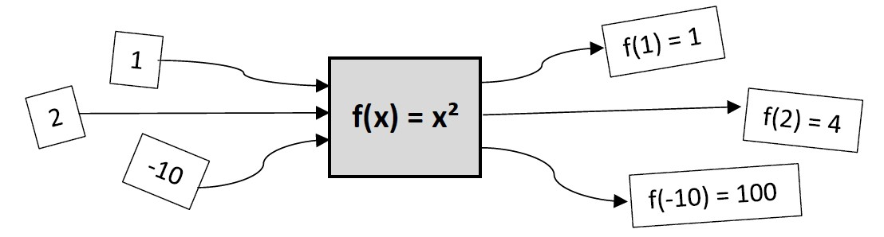

---
##### Ganzrationale Funktionen
$𝑓(𝑥)=𝑎𝑥^𝑛+𝑏𝑥^{𝑛−1}+𝑐𝑥^{𝑛−2}+⋯$
- Funktionsterm heißt Polynom
- a, b, c, … heißen Koeffizienten
- Höchster Exponent n heißt Grad des Polynoms
- Der Grad des Polynoms kann erst beim vollständig ausmultiplizierten Polynom bestimmt werden.

---
##### Ganzrationale Funktionen

---
##### Verschiedene Schreibweisen von ganzrationalen Funktionen
- Polynomform
- Scheitelpunktsform
- Nullstellenform

---
##### Exponential- und Logarithmusfunktionen
- Sind Gegen-/Umkehrfunktionen
- $\mathrm e > 0, \quad \ln x, x > 0$

---
<!--header: Analysis | Kurvendiskussion: Funktionen manipulieren-->
### Funktionen manipulieren
##### Sinus und Cosinus
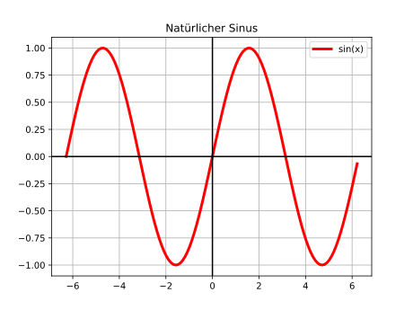

---
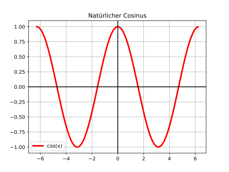
- Amplitude A:
- Periode T:

---
##### Strecken und Stauchen
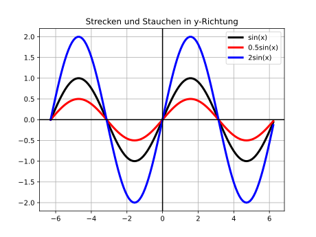

---
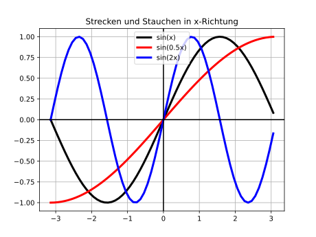

---
##### Verschieben
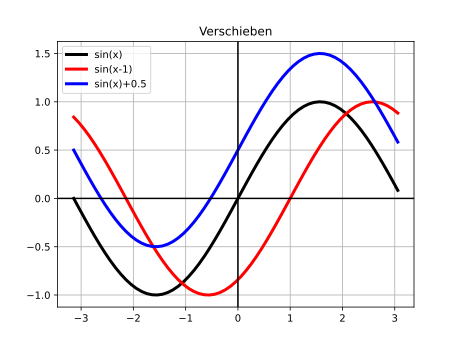

---
##### Spiegeln
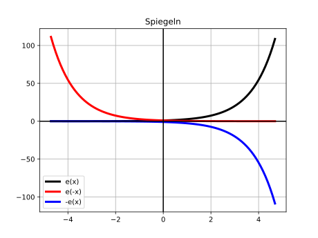

---
<!--header: Analysis | Kurvendiskussion: Nullstellen-->
### Nullstellen 

$f(x_{Nullstellen})=0$

- Ein Polynom vom Grad n besitzt höchstens n Nullstellen (nach Vielfachheit!).
- Einfache Nullstellen: Graph schneidet die x-Achse
- Dreifache, fünffache, … Nullstellen: Graph schneidet die x-Achse, schmiegt sich aber an die x-Achse an
- Doppelte, vierfache, sechsfache, … Nullstellen: Graph berührt die x-Achse
- $𝑓(𝑥)=𝑎⋅(𝑥−α)⋅(𝑥−β)⋅…⋅(𝑥−γ)^2⋅(𝑥−δ)^2⋅…$
α,β,… einfache Nullstellen und γ,δ,… doppelte Nullstellen

---

---
##### Rezept
Funktion gleich null setzen und Gleichung lösen

$f(x)=x^5-9x^3$

---
##### Nullstellen bei Sinus und Kosinus
- Nullstellen des natürlichen $\sin$: $x = n\pi, n \in \mathbb{Z}$
- Nullstellen des natürlichen $\cos$: $x = \frac{(2n+1)}{2}\pi, n \in \mathbb{Z}$

Rezept: Argument der trigonometrischen Funktion mit der "Nullstelle" gleichsetzen

$f(x) = 3sin(2x)$

$2x = n\pi \qquad |:2$
$x = \frac{n\pi}{2}, n \in \mathbb{Z}$

Da trigonometrische Funktionen periodisch sind, gibt es logischerweise unendlich viele Lösungen!

---
<!--header: Analysis | Kurvendiskussion: Rechenblock Funktionen-->
### Kurvendiskussion: Rechenblock Funktionen

| Schwierigkeit | Aufgaben |
| ----------- | ----------- |
| leicht |  |
| mittel | A-21, A-23, A-24 |
| schwer |  |

Für Schnelle und Unterforderte: 
- Aufgabe A-161 (S. A-264) ff.
- Aufgabenblatt Analysis Grundlagen und Funktionsklassen
- Altabitur 2020 Analysis

---

---

---
<!--header: Analysis | Kurvendiskussion: Definitionsmengen-->
### Definitionsmengen 

Definitionsmenge $D_f$ ist die Menge aller Zahlen, die ohne Widerspruch in eine Funktion *f* eingesetzt werden dürfen.

Grundannahme: $D_f = \mathbb{R}$

Ausnahmen:
| Funktion | Bruch | Wurzel | Logarithmus | 
| ----------- | ----------- | --- | --- |
| Einschränkung | $\frac{Zähler}{Nenner}$ | $\sqrt{Argument}$ | $\ln{(Argument)}$
|   | $Nenner \neq 0$ | $Argument \geq 0$ | $Argument > 0$ |

---
##### Mengen und Mengenschreibweisen
- Menge der reellen Zahlen: $\mathbb{R}$
Menge der positiven reellen Zahlen mit der Null: $\mathbb{R}_0^+$
- Menge der rationalen Zahlen: $\mathbb Q$
Alle Zahlen, die als Bruch dargestellt werden können
- Einzelne Zahlen mit Mengenklammern: $D_f = \{1,2,3\}$ (Hier sind nur 1,2 und 3 Teil der Definitionsmenge)
- Einzelne Zahlen *ausschließen* mit Mengenklammern: $D_f = \mathbb{R} \setminus \{1,2,3\}$ (Hier sind nur 1,2 und 3 *nicht* Teil der Definitionsmenge)
- Größere Mengen mit Mengenklammern: $D_f = \{x| -4<x<-2 \cup 2<x<4\}$ ("Alles zwischen -4 und -2 sowie zwischen 2 und 4")

---
- Größere Mengen mit Intervallklammern: $D_f = [-4,-2] \cup [2,4]$ ("Alles zwischen -4 und -2 sowie zwischen 2 und 4")
- Abgeschlossen: $[a, b]$ (alle Zahlen zwischen a und b)
- Halboffen $[a, b[$ (alle Zahlen zwischen a und b, aber b nicht mehr)
- Offen $]a, b[$ (alle Zahlen zwischen a und b, aber a und b nicht mehr)
- Merke: Bei $+\infty$ und $-\infty$ zeigen die Klammern immer vom $\infty$ weg!

---
| Funktion | Bruch | Wurzel | Logarithmus | 
| ----------- | ----------- | --- | --- |
| Einschränkung | $\frac{Zähler}{Nenner}$ | $\sqrt{Argument}$ | $\ln{(Argument)}$
|   | $Nenner \neq 0$ | $Argument \geq 0$ | $Argument > 0$ |

##### Rezept
1. $D_f = \mathbb{R}$
2. Überprüfe, ob Ausnahmen in der Funktion sind
3. Ausnahme prüfen
3a. Bei Bruch $Nenner = 0$ setzen und lösen. Für gefundene Lösung $x_{Nenner = 0}$ gilt: $D_f = \mathbb{R} \setminus \{x_{Nenner = 0}\}$
3b. Bei Wurzel und Logarithmus Ungleichung lösen. Die Lösung dann in Intervall- (z.B $\mathcal{L} = ]-\infty, 0]$) oder Mengenschreibweise (z.B $\mathcal{L} = \{x | x < 0$\} gesprochen: "x mit der Eigenschaft x kleiner als 0") angeben

---
##### Brüche
$f(x) = \frac{Zähler}{Nenner}, Nenner \neq 0$

$f(x)=\frac{x^2+3x}{x+7}$

---
##### Wurzeln
$f(x)=\sqrt{Argument}, Argument \geq 0$

$g(x)=\sqrt{x+16}$

---
##### Logarithmus
$f(x)=\ln{(Argument)}, Argument > 0$

$h(x)=\ln{(x-3)}$

---
<!--header: Analysis | Kurvendiskussion: Rechenblock 1-->
### Kurvendiskussion: Rechenblock 1

| Schwierigkeit | Aufgaben |
| ----------- | ----------- |
| leicht | A-1 |
| mittel | A-2 |
| schwer |  |

Für Schnelle und Unterforderte: 
- Aufgabe A-161 (S. A-264) ff.
- Aufgabenblatt Analysis Grundlagen und Funktionsklassen
- Altabitur 2020 Analysis

---

---

---
<!--header: Analysis | Kurvendiskussion: Änderungsraten-->
### Änderungsraten

##### Durchschnittliche oder Mittlere Änderungsrate
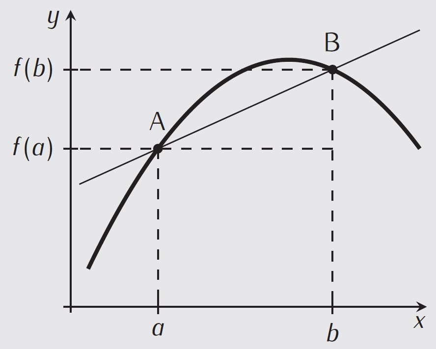
Sekante durch zwei Punkte

$m = \frac{f(b)-f(a)}{b-a}$

---
##### Momentane oder aktuelle Änderungsrate
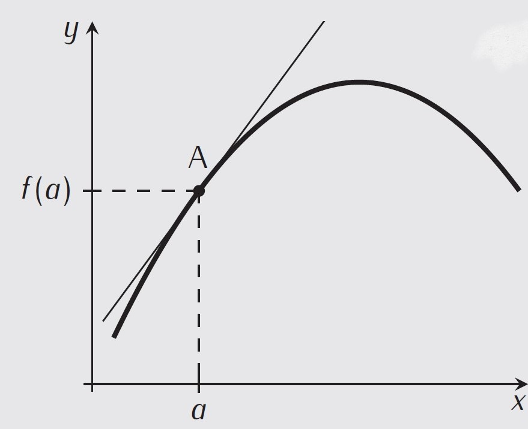
Tangente an einem Punkt

$m = f^\prime (x)$

---
<!--header: Analysis | Kurvendiskussion: Ableitungen-->
### Ableitungen
| Funktion | $f(x) = x^n$ | $\mathrm e ^x$ | $\ln x$ | $sin x$ | $cos x$ |
| ----------- | ----------- | --- | --- | --- | --- |
| Ableitung | $f^\prime (x) = nx^{n-1}$ | $\mathrm e ^x$ | $\frac{1}{x}$ | $cos x$ | $-sin x$ |

##### Rechenregeln
Kettenregel: $u(v(x)) \implies u^\prime (v(x)) \cdot v^\prime (x)$
Produktregel: $u(x) \cdot v(x) = u(x) \cdot v^\prime (x) + u^\prime (x) \cdot v(x)$

##### Wurzeln <-> Potenzen (Nur bei Ableitungen und Integration sinnvoll!)
- $\sqrt x = \sqrt[2] x = x^{\frac{1}{2}}$
- $\frac{1}{x} = x^{-1}$
- $\frac{1}{\sqrt x} = x^{-\frac{1}{2}}$

---
##### Rezept
1. Brüche und Wurzeln in Exponenten umwandeln
2. Klammern ausmultiplizieren (Summenregel ist einfacher als Produktregel)
3. Ableiten
##### Beispiele
$f(x) = \frac{1}{x}$

$g(x) = \mathrm e ^{(x^2+4)}$

$h(x) = \sin(e^x + \frac{1}{x})$

$i(x) = \cos x \cdot \sin x$

---
$j(x)=-\sin x (x^3+\ln x)$

  

$k(x) = \frac{3}{5 \sqrt[3]{x}}$

$l(x) = \frac{x^2+x}{ln x}$

---
<!--header: Analysis | Kurvendiskussion: Rechenblock 2-->
### Kurvendiskussion: Rechenblock 2

| Schwierigkeit | Aufgaben |
| ----------- | ----------- |
| leicht | A-33, A-30 |
| mittel | A-34, A-31 |
| schwer | A-32 |

Für Schnelle und Unterforderte: 
- Aufgabe A-161 (S. A-264) ff.
- Aufgabenblatt Analysis Ableitungen
- Aufgabenblatt Analysis Grundlagen und Funktionsklassen
- Altabitur 2020 Analysis

---

---

---
<!--header: Analysis | Kurvendiskussion: Tangentengleichungen-->
### Tangentengleichungen $y = mx +c$
- Tangentengleichung an einem Punkt
- Tangentengleichung mit gegebener Steigung

---
##### Tangentengleichung an einem Punkt: Rezept mit Beispiel

$f(x)=-3x^3-x, \quad x = -1$
1. Punkt ausrechnen
$f(-1) = -3(-1)^3 - (-1) = 4 \implies P(-1|4)$
2. Ableiten und Stelle einsetzen
$f^\prime (x) = -9x^2 - 1$
$m = f^\prime (-1) = -9(-1)^2 - 1 = -10$
3. In Geradengleichung einsetzen
$y = mx +c$
$4 = (-10)(-1) + c \qquad | -10$
$c = -6$
4. Geradengleichung angeben $y = -10x -6$

---
##### Tangentengleichung an einem Punkt: Formel
Mit $f(x), \quad P(a, f(a))$
$y = f^\prime (a) \cdot (x-a) + f(a)$

$f(x)=-3x^2-x, \quad x = -1$
1. Punkt ausrechnen
$f(-1) = -3(-1)^3 - (-1) = 4 \implies P(-1|4)$
2. Ableiten und Stelle einsetzen
$f^\prime (x) = -9x^2 - 1$
$m = f^\prime (-1) = -9(-1)^2 - 1 = -10$
3. In Formel einsetzen und vereinfachen
$y = -10 \cdot (x-(-1)) + 4 = -10x -10 + 4 = -10x -6$

Exakt gleiche Lösung, leicht anderer Weg!

---
##### Tangentengleichung mit gegebener Steigung
##### Rezept mit Beispiel

$f(x)=x^2 + 2x +1, \quad m=6$
1. Ableiten und mit Steigung gleichsetzen
$f^\prime (x) = 2x+2 = 6 \qquad | -2$
$2x = 4 \qquad | :2 \quad \implies x = 2$
2. Punkt ausrechnen
$f(2) = 2^2 + 2 \cdot 2 + 1 = 9 \implies P(2|9)$
3. In Geradengleichung einsetzen
$y = mx +c$
$9 = 6 \cdot 2 + c \qquad | -12$
$c = -3$
4. Geradengleichung angeben $y = 6x - 3$

---
### Normale
Zwei Funktionen $f_1$ mit der Steigung $m_1$ an der Stelle $x_0$ und $f_2$ mit der Steigung $m_2$ an der Stelle $x_0$ sind im Punkt $x_0$ senkrecht zu einander wenn gilt:
$m_1 = -\frac{1}{m_2}$

---
##### Rezept für Normalen mit Beispiel
$f(x) = x^3-2, \quad P(-1|-3)$: Bestimme Normale im Punkt P

1. Ableiten
$f^\prime(x) = 3x^2$
2. Gewünschten Punkt in Ableitung einsetzen
$m_t = f^\prime(-1) = 3(-1)^2 = 3$
3. Steigung der Normalen bestimmen
$m_n = -\frac{1}{m_t} = -\frac{1}{3}$
4. Alles in die Geradengeleichung einsetzen und c ausrechnen
$y = mx+c \implies -3 =  -\frac{1}{3} \cdot (-1) + c \implies c = -\frac{10}{3}$
5. Normalengleichung angeben
$y = -\frac{1}{3}x-\frac{10}{3}$

---
<!--header: Analysis | Kurvendiskussion: Rechenblock 3-->
### Kurvendiskussion: Rechenblock 3

| Schwierigkeit | Aufgaben |
| ----------- | ----------- |
| leicht | A-36, A-38 |
| mittel | A-37, A-39, A-40, A-41 |
| schwer | A-42 |

Für Schnelle und Unterforderte: 
- Extrablatt zu den Normalen mit Aufgaben 57, 58, 59
- Aufgabe A-161 (S. A-264) ff.
- Aufgabenblatt Analysis Ableitungen
- Aufgabenblatt Analysis Kurvendiskussion
- Altabitur 2020 Analysis

---

---

---
<!--header: Analysis | Kurvendiskussion: Extrempunkte und Monotonie-->
### Extrempunkte und Monotonie
##### Rezept mit Beispiel

$f(x) = x^3 - 12x^2 + 36x$
1. Ableiten und gleich null setzen $f^\prime (x) = 0$
$f^\prime (x) = 3x^2 - 24x + 36 = 0$
Mit Mitternachtsformel: $x_1 = 2, \quad x_2 = 6$
2. Vorzeichentabelle
Oben die *x-Stellen*, unten die zugehörigen *Funktionswerte*
Interessant sind die *Extremstellen*, diese in die Tabelle eintragen und dazwischen Platz lassen.

| *x* | &nbsp; &nbsp; | 2 | &nbsp; &nbsp; | 6 | &nbsp; &nbsp; |
| ----------- | ----------- | --- | --- | --- | --- |
| $f^\prime (x)$ |  | 0 |  | 0 |  |

---
Jetzt beliebige *x-Stellen* zwischen den *Extremstellen* festlegen um das verhalten der Funktion zwischen ihnen zu untersuchen
| *x* | 0 | 2 | 4 | 6 | 8 |
| ----------- | ----------- | --- | --- | --- | --- |
| $f^\prime (x)$ |  | 0 |  | 0 |   |

Nun die *Ableitung* (Steigung) an den Zwischenpunkten berechen, der Wert ist dabei nicht entscheidend, nur das Vorzeichen (steigt oder fällt)

$f^\prime (0) = 3 \cdot 0^2 - 24 \cdot 0 + 36 = 36 \implies +$
$f^\prime (4) = 3 \cdot 4^2 - 24 \cdot 4 + 36 = -12 \implies -$
$f^\prime (8) = 3 \cdot 8^2 - 24 \cdot 8 + 36 = 36 \implies +$

---
In die Vorzeichentabelle eintragen
| *x* | 0 | 2 | 4 | 6 | 8 |
| ----------- | ----------- | --- | --- | --- | --- |
| $f^\prime (x)$ | + | 0 | - | 0 | + |

3. Funktionswerte ausrechnen!
$f(2) = 32 \implies HP(2|32)$
$f(6) = 0 \implies TP(6|0)$

4. Evtl. Monotonie angeben
$f(x)$ monoton steigend für $I = ]-\infty, 2]$
$f(x)$ monoton fallend für $I = [2,6]$
$f(x)$ monoton steigend für $I = [6,\infty[$

---
##### Methode mit der zweiten Ableitung
Extremstellen mit Mitternachtsformel: $x_1 = 2, \quad x_2 = 6$
$f^\prime (x) = 3x^2 - 24x + 36 = 0$

$f^{\prime \prime} (x) = 6x -24$
$f^{\prime \prime} (2) = 6 \cdot 2 -24 = -12 < 0 \implies HP$
$f^{\prime \prime} (6) = 6 \cdot 6 -24 = 12 > 0 \implies TP$

##### Warum ist die Methode mit der zweiten Ableiten doof?
- Hier muss nochmal abgeleitet werden, beim Ableiten kann mehr schief gehen als beim einsetzen in den Taschenrechner!
- Außerdem funktioniert die Methode nicht immer!

---
##### Warum ist die Methode mit der zweiten Ableiten doof?
$f(x) = x^4$

---
<!--header: Analysis | Kurvendiskussion: Wendestellen und Krümmungsverhalten-->
### Wendestellen und Krümmungsverhalten
##### Rezept mit Beispiel (genau wie Extrempunkte, nur mit zweiter Ableitung)

$f(x) = x^3-12x^2+36x$
1. Zweimal ableiten und gleich null setzen $f^{\prime \prime} (x) = 0$
$f^\prime (x) = 3x^2 - 24x + 36$
$f^{\prime \prime} (x) = 6x - 24 = 0 \implies x = 4$
2. Vorzeichentabelle (diesmal mit zweiter Ableitung)
Hierbei geht es v.a darum, dass ein Vorzeichenwechsel statt findet und es tatsächlich eine Wendestelle ist.

| *x* | 3 | 4 | 5 |
| ----------- | ----------- | --- | --- |
| $f^{\prime \prime}(x)$ | - | 0 | + |

---
| *x* | 3 | 4 | 5 |
| ----------- | ----------- | --- | --- |
| $f^{\prime \prime}(x)$ | - | 0 | + |

3. Funktionswerte ausrechnen!
$f(4) = 16 \implies WP(4|16)$

4. Evtl. Krümmung angeben
$+ \implies -$: Wechsel von Links- auf Rechtskrümmung
$- \implies +$: Wechsel von Rechts- auf Linkskrümmung

---
<!--header: Analysis | Kurvendiskussion: Rechenblock 4-->
### Kurvendiskussion: Rechenblock 4

| Schwierigkeit | Aufgaben |
| ----------- | ----------- |
| leicht | A-56, A-57, A-58, A-63 |
| mittel | A-59, A-60, A-64, A-65, A-66, A-67 |
| schwer | A-61, A-62, A-81 |

Für Schnelle und Unterforderte: 
- Aufgabe A-76 (S. A-145) ff.
- Aufgabe A-161 (S. A-264) ff.
- Aufgabenblatt Analysis Ableitungen
- Aufgabenblatt Analysis Kurvendiskussion
- Altabitur 2020 Analysis

---

---

---
<!--header: Analysis | Kurvendiskussion: Verhalten im Unendlichen-->
### Verhalten im Unendlichen
##### Polynome
- Setze für *x* große positive/negative Zahlen ein
- Alternativ: Höchsten Potenz betrachten
$f(x) = x^5+x^4-x+7$

$\lim \limits_{x \to +\infty} =$
$\lim \limits_{x \to -\infty} =$

---
##### Gemischte Funktionen
Summanden und Faktoren einzeln betrachten und zusammen rechnen. Bei Unklarheit Dominanzanalyse!
$\ln < Wurzel < x^n < e^x$ ($\ln$ verliert, $\mathrm e$ gewinnt)

$f(x) = \mathrm e^{-x} +\frac{1}{x} +1$
&nbsp;
&nbsp;
&nbsp;
$g(x) = \frac{1}{x} \mathrm e ^x$
&nbsp;
&nbsp;
&nbsp;
$h(x) = \frac{1}{x} + \ln x$

---
<!--header: Analysis | Kurvendiskussion: Brüche-->
### Brüche (Gebrochenrationale Funktionen)
- $f(x) = \frac{Zähler}{Nenner}$, mit Zähler und Nenner Polynom
- Graph heißt Hyperbel
- Brüche können waagrechte, senkrechte und schräge Asymptoten haben

##### Senkrechte Asymptoten
Definitionsmenge: $Nenner \neq 0$
- Gebrochenrationale Funktionen haben an ihren Definitionslücken Polstellen (senkrechte Asymptoten)
- Es gibt Polstellen mit und ohne Vorzeichenwechsel (so wie Nullstellen)

---
- Polstelle mit Vorzeichenwechsel $f(x) = \frac{1}{x-1}$
ungerader Exponent
&nbsp;
&nbsp;
&nbsp;
&nbsp;
&nbsp;
- Polstelle ohne Vorzeichenwechsel $g(x) = \frac{1}{(x-1)^2}$
gerader Exponent

---
##### Hebbare Polstellen
- Ist eine Nullstelle des Nenners gleichzeitig auch Nullstelle des Zählers, so ist diese Definitionslücke keine Polstelle, sondern eine hebbare Definitionslücke!
- Es gibt nur ein "Loch" im Graphen

$f(x) = \frac{2x+4}{(x+2)(x-1)}$
- Nullstellen des Zählers: $x = -2$
- Nullstellen des Nenners: $x_1 = -2, x_2 = 1$
$\implies \mathcal{D}_f = \mathbb{R} \setminus \{-2,1\}$
Aber: $x=1$ ist eine einfache Polstelle und $x=-2$ ist keine Polstelle, sondern eine hebbare Definitionslücke, da sie auch Nullstelle des Zählers ist!

---
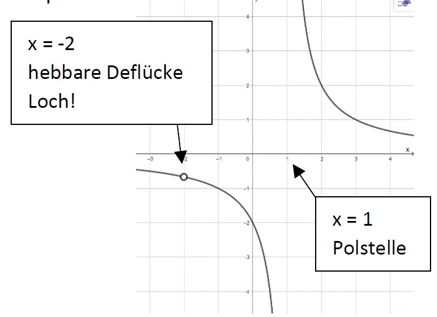

---
##### Rezept senkrechte Asymptoten:
1. Nullstellen von Zähler und Nenner ausrechnen
2. Alle Nullstellen des Nenners, die nicht auch Nullstelle des Zählers sind, sind Polstelle und durch sie verläuft somit eine senkrechte Asymptote
3. Grenzwertbetrachtung durchführen

---
##### Waagrechte/Schräge Asymptoten
Zählergrad (ZG) ist der höchste Exponent des Zählers, Nennergrad (NG) der höchste Exponent des Nenners (natürlich in vorständig ausmultiplizierter Form!)

- Fall 1: ZG < NG
Die waagrechte Asymptote liegt bei $y = 0$ (x-Achse)
$\lim \limits_{x \to \pm \infty} = 0$

$f(x) = \frac{1}{x}$

---
- Fall 2: ZG = NG
Mit dem Vorfaktor der höchsten Potenz des Zählers *a* und dem Vorfaktor der höchsten Potenz des Nenners *b*: 
Die waagrechte Asymptote liegt bei $y = \frac{a}{b}$
$\lim \limits_{x \to \pm \infty} = \frac{a}{b}$

$f(x) = \frac{2x-1}{-x+1}$

$\lim \limits_{x \to \pm \infty} = \frac{2}{-1} = - 2 \quad \implies y = -2$

---
- Fall 3: ZG eins höher als NG
Es gibt eine schräge Asymptote. Polynomdivision.

$f(x) = \frac{(3+x)^2}{x-1}$

---
- Fall 4: ZG mehr als eins größer als NG
Keine waagrechte/schrägen Asymptote

---
<!--header: Analysis | Kurvendiskussion: Rechenblock 5-->
### Kurvendiskussion: Rechenblock 5

| Schwierigkeit | Aufgaben |
| ----------- | ----------- |
| leicht |  |
| mittel | A-9, A-10, A-11, A-12 |
| schwer |  |

Für Schnelle und Unterforderte: 
- Aufgaben im Extradokument zu Gebrochenrationalen Funktionen
- Aufgabe A-76 (S. A-145) ff.
- Aufgabe A-161 (S. A-264) ff.
- Aufgabenblatt Analysis Kurvendiskussion

---

---

---
<!--header: Analysis | Kurvendiskussion: Symmetrie-->
### Symmetrie
- Achsensymmetrisch, wenn $f(-x) = f(x)$
- Punktsymmetrisch (zum Ursprung), wenn $f(-x) = -f(x)$

##### Rezept
1. $(-x)$ in die Funktion einsetzten
2. Versuche. ob durch Umformung/Vereinfachung entweder wieder $f(x)$ oder $-f(x)$ erreicht werden kann.
3. Wenn keines davon oder eine Mischvor vorliegt, gibt es keine Symmetrie

---
##### Polynome
- Wenn alle Exponenten in einem Polynome gerade sind (z.B $f(x) = x^6 +3x^4 -2x^2 + 4$), liegt Achsensymmetrie vor
- Wenn alle Exponenten in einem Polynome ungerade sind (z.B $f(x) = x^7 +3x^5 -2x$), liegt Punktsymmetrie vor. Zusätzlich darf hier keine Verschiebung an der y-Achse vorliegen, sonst geht die Funktion schließlich nicht mehr durch den Ursprung

---
##### Beispiel
$f(x) = x^3 + 12x^2 + 36x$
0. Mit dem Satz für Polynome folgt sofort keine Symmetrie (Mischform)
1. und 2. $(-x)$ einsetzen
$$\begin{aligned}
f(-x) & = (-x)^3 + 12(-x)^2 + 36(-x) = \\
& = -x^3 + 12x^2 - 36x
\end{aligned}$$
3. Ist weder $f(x)$ oder $-f(x)$

---
<!--header: Analysis | Kurvendiskussion: Funktionen zeichnen-->
### Funktionen zeichnen
- Immer wichtig grob im Kopf zu haben, wie die Basisfunktionen aussehen.
- Soviele verfügbare Punkte suchen, wie möglich. Diese kommen entweder aus einer Kurvendiskussion oder aus gegebenen Ableitungen/Stammfunktionen

##### Rezept: Ableitungen/Stammfunktionen zeichnen
1. Markante Punkte in der gegebenen Funktion finden (Nullstellen, Extremstellen, Sattelpunkte, Wendestelle)
2. Mit dem NEW Schema übersetzen
3. Punkte einzeichnen und Graph durchziehen

---
##### NEW Schema
N = Nullstelle, E = Extremstelle, W = Wendestelle

| Funktion | | | | | | |
| --- | --- | --- | --- | --- | --- | --- |
| $F(x)$ | N | E | W |  |  |  |
| $f(x)$ |  | N | E | W |  |  |
| $f^\prime(x)$ |  |  | N | E | W |  |
| $f^{\prime \prime}(x)$ |  |  |  | N | E | W |

Beispiel: Falls $f$ an der Stelle $x=0$ eine Wendestelle (W) besitzt, so besitzt $f^{\prime \prime}(x)$ an dieser Stelle eine Nullstelle (N)!

---
Zusatzinformationen beim Ableiten
- Extrempunkte $\implies$ Nullstellen mit VZW
- Sattelpunkte $\implies$ Nullstellen ohne VZW
- In allen Abschnitten, in denen der Graph von $f$ steigt, verläuft der Graph von $f^\prime (x)$ oberhalb der x-Achse.
- In allen Abschnitten, in denen der Graph von $f$ fällt, verläuft der Graph von $f^\prime (x)$ unterhalb der x-Achse.

---
Beispiel
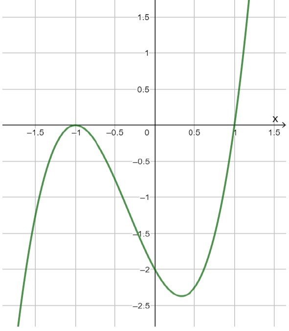

---
<!--header: Analysis | Kurvendiskussion: Rechenblock 6-->
### Kurvendiskussion: Rechenblock 6

| Schwierigkeit | Aufgaben |
| ----------- | ----------- |
| leicht | A-69, A-70, A-71 |
| mittel | A-25, A-26, A-27, A-72, A-73 |
| schwer | A-28, A-29, A-74, A-75 |

Für Schnelle und Unterforderte: 
- Aufgabe A-76 (S. A-145) ff.
- Aufgabe A-161 (S. A-264) ff.
- Aufgabenblatt Analysis Kurvendiskussion
- Altabitur 2020 Analysis

---

---

---