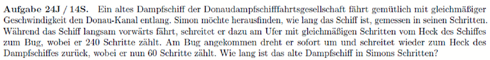
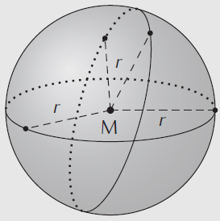
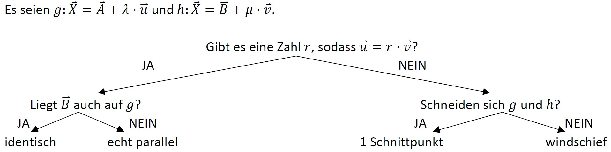
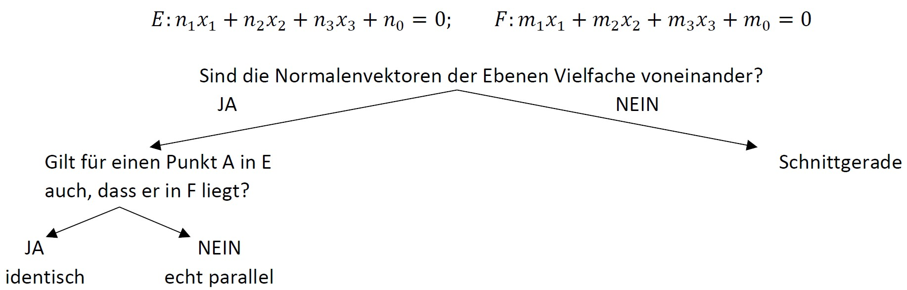
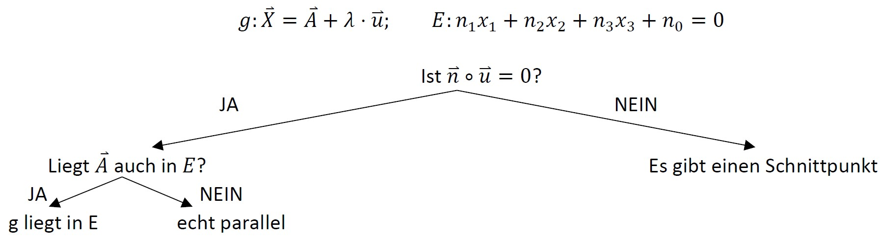
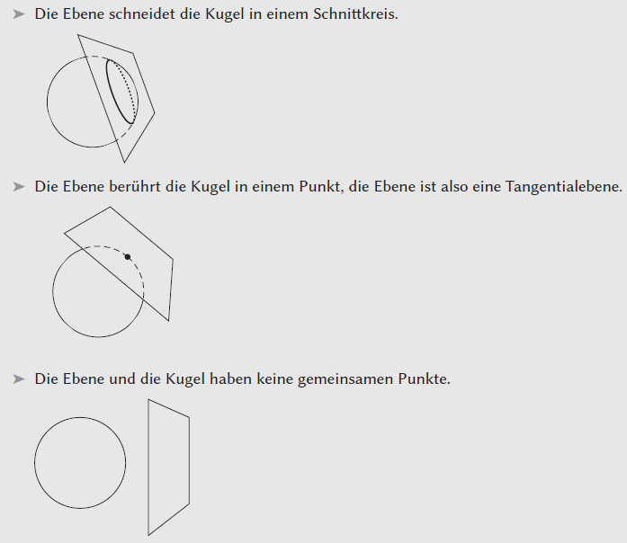

# Geometrie
- Lineare Gleichungssysteme
- Vektorgrundlagen
- Geraden, Ebenen und Kugeln
- Lagebeziehungen und Schnittmengen
- Winkel
- Abstände
- Schattenpunkte
- Spiegelpunkte

---
<!--header: Geometrie | Lineare Gleichungssysteme-->
### Lineare Gleichungssysteme
##### Wie löse ich ein LGS?
$I, x_1+x_2 =0$
$II, x_1-x_2 =2$
- Addieren/Subtrahieren (Immer beider Seiten!):
$I+II: x_1+x_2 +x_1-x_2 =0 +2$
$2x_1 = 2 \qquad |:2$
$x_1 =1 \implies x_2 = -1$
- Einsetzen (Nach einer Variable auflösen und einsetzen): 
$I: x_1+x_2 =0 \qquad | -x_2$
$x_1 = -x_2$
in $II: -x_2-x_2 = 2$
$-2x_2 = 2 \qquad |:(-2)$
$x_2 = -1 \implies x_2 = -1$

---
$I, x_1+x_2 =0$
$II, x_1-x_2 =2$
- Gleichsetzen (Beide Gleichungen brauchen eine identische Seite, z.B mit Null)
$II: x_1-x_2 =2 \qquad | -2$
$x_1-x_2 -2=0$
$I=II: x_1+x_2 = x_1-x_2 -2 \qquad | -x_1$
$x_2 = -x_2 -2 \qquad |+x_2$
$2x_2 = -2 \qquad |:2$
$x_2 = -1 \implies x_2 = -1$

##### Lösungsmöglichkeiten
- Genau eine Lösung
- Keine Lösung
- Unendlich viele Lösungen

---
<!--footer: Abiturma Abivorbereitungskurs | Winter 2023 München | Vinzenz Männig-->
##### Was sind LGS?
- Interpretation der Lösung
- Interpretation der Addition
$I, x_1-x_2 =0$
$II, x_1+x_2 =2$

---

---
### Gleichungen: Rechenblock
Aufgabe 99

$I, x_1+x_2+x_3=1$
$II, x_1-2x_2+3x_3=0$
$III, 2x_1+3x_2+3x_3=0$

$I, 2x_1+2x_2-2x_3=0$
$II, x_1-x_2-2x_3=2$
$III, 4x_1+6x_2+2x_3=0$

---
<!--header: Geometrie | TODO-->
### Vektorgrundlagen
- Vektoren funktionieren wie Wegbeschreibungen
- Ortsvektoren (Koordinaten), Vektor vom Ursprung zum Punkt, ein Großbuchstabe $\vec A$
- Alle anderen Vektoren mit zwei Großbuchstaben $\vec {AB}$ oder einem Kleinbuchstaben $\vec a$

---
- Kolinearität: Ein Vektor ist das Vielfache eines Anderen
$\vec a = \begin{pmatrix}7 \\ 3 \\ -1\end{pmatrix}, \quad \vec b = \begin{pmatrix}-21 \\ -9 \\ 3\end{pmatrix}$
- Betrag: $\vec a = \begin{pmatrix}a_1 \\ a_2 \\ a_3\end{pmatrix} \implies |\vec a| = \sqrt{a_1^1+a_2^2+a_3^2}$ (Länge des Vektors)
- Normierter Vektor (Vektor mit der Länge 1): $\vec{a_0} = \frac{\vec a}{|\vec a|}$

---
- Lineare Abhängigkeit: 
"Kann man einen Vektor durch andere Vektoren ausdrücken? Kann ich das Ziel auf mit anderen gestückelten Teilwegbeschreibungen erreichen?"

---
- Lineare Abhängigkeit: 
Rezept: 
2-dimensional: Ein Vektor ist zu einem anderen nur lin. Abh., wenn die beiden kolinear sind. Bei drei oder mehr Vektoren herscht immer lin. Abh.
3-dimensional: Ein Vektor ist zu einem anderen nur lin. Abh., wenn die beiden kolinear sind. Drei Vektoren sind lin. Abh., wenn das Spatprodukt aus ihnen null ergibt. Bei vier oder mehr Vektoren sind immer min. zwei lin. Abh.

---
- Skalarprodukt:
$\begin{pmatrix}a_1 \\ a_2 \\ a_3 \end{pmatrix} \circ \begin{pmatrix}b_1 \\ b_2 \\ b_3 \end{pmatrix} = a_1b_1 + a_2b_2 + a_3b_3$
$\vec a \circ \vec b = 0 \Leftrightarrow \vec a \perp \vec b$
$\cos \alpha = \frac{\vec a \circ \vec b}{|\vec a| \cdot |\vec b|}$

---
- Kreuzprodukt:
$\begin{pmatrix}a_1 \\ a_2 \\ a_3 \end{pmatrix} \times \begin{pmatrix}b_1 \\ b_2 \\ b_3 \end{pmatrix} = \begin{pmatrix} a_2b_3 - a_3b_2 \\ a_3b_1 - a_1b_3 \\a_1b_2 - a_2b_1 \end{pmatrix}$
$\vec c = \vec a \times \vec b = 0 \Leftrightarrow \vec a \perp \vec c, \vec b \perp \vec c$
$\sin \alpha = \frac{|\vec a \times \vec b|}{|\vec a| \cdot |\vec b|}$

$\begin{pmatrix}-2 \\ 3 \\ 1 \end{pmatrix} \times \begin{pmatrix}10 \\ 2 \\ -1 \end{pmatrix}$

---
- Volumina:
$A_\triangle = \frac{1}{2} |\vec a \times \vec b|$
$A_\square = |\vec a \times \vec b|$
$A_{Pyramide} = \frac{1}{6} |(\vec a \times \vec b) \circ \vec c|$
$A_{Spat} = |(\vec a \times \vec b) \circ \vec c|$

---
### TODO: Rechenblock

| Schwierigkeit | Aufgaben |
| ----------- | ----------- |
| leicht | 100, 103, 105, 108, 109, 110, 113, 115 |
| mittel | 101, 102, 106, 111, 112, 114 |
| schwer | 104 |

Für Schnelle und Unterforderte:
- Aufgabe 107
- Umfangreiche Aufgaben 155ff.

---

---

---
<!--header: Geometrie | Geraden, Ebenen und Kugeln-->
### Geraden, Ebenen und Kugeln
##### Geradengleichung
$g: \vec X = \vec A + r \cdot \vec v$
Geradengleichungen sind nicht eindeutig!

##### Rezept Gerade aufstellen mit Beispiel
$A(3|2|0), B(8|3|1)$
1. Bestimme Stützvektor $\vec A$ als einen Beliebigen der Punkte
$\vec A = \begin{pmatrix}3\\2\\0 \end{pmatrix}$

---
2. Bestimme Spannvektor $\vec v$ als Verbindungsvektor der beiden Punkte
$\vec v = \begin{pmatrix}8\\3\\1 \end{pmatrix} - \begin{pmatrix}3\\2\\0  \end{pmatrix} = \begin{pmatrix}5\\1\\1 \end{pmatrix}$
3. Gleichung angeben
$g: \vec X = \begin{pmatrix}3\\2\\0 \end{pmatrix} + r \cdot \begin{pmatrix}5\\1\\1 \end{pmatrix}$

---
##### Rezept Punktprobe Gerade mit Beispiel
$g: \vec X = \begin{pmatrix}3\\7\\1 \end{pmatrix} + r \cdot \begin{pmatrix}2\\0\\17 \end{pmatrix}$
Entscheide, ob $A(9|7|20)$ auf der Gerade liegt.
1. Ersetze $\vec X$ durch den Punkt
$\begin{pmatrix}9\\7\\20 \end{pmatrix} = \begin{pmatrix}3\\7\\1 \end{pmatrix} + r \cdot \begin{pmatrix}2\\0\\17 \end{pmatrix}$
2. LGS aufstellen und lösen
$3+2p=9 \implies p =2$
$7 = 7$
$1+17p=20 \implies P = \frac{19}{17} \implies$ Keine Lösung, A nicht auf g
---
##### Ebenengleichung in Parameterform
$g: \vec X = \vec A + r \cdot \vec u + s \cdot \vec v$
Ebenengleichung sind nicht eindeutig!
Die Spannvektoren $\vec u$ und $\vec v$ dürfen dabei keine Vielfaches voneinander sein!
##### Rezept Ebene aufstellen
1. Bestimme Stützvektor $\vec A$ als einen Beliebigen der Punkte
2. Bestimme die Spannvektoren $\vec u$ und $\vec v$ als Verbindungsvektor jeweils zweier Punkte
3. Gleichung angeben

---
##### Ebenengleichung in Koordinatenform
$E: n_1x_1 + n_2x_2 + n_3x_3 = a$
Der Normalenvektor $\vec n$ steht senkrecht auf der Ebene
$\vec n = \begin{pmatrix}n_1\\n_2\\n_3 \end{pmatrix}$
Auch Koordinatenformen sind nicht eindeutig!

##### Rezept Parameterform in Koordinatenform mit Beispiel
$A(2|3|-1), B(3|3|-2), C(-1|7|1)$
1. Parameterform aufstellen
$E: \vec X = \begin{pmatrix}2\\3\\-1 \end{pmatrix} + r \cdot \begin{pmatrix}1\\0\\-1 \end{pmatrix} + s \cdot \begin{pmatrix}-3\\4\\2 \end{pmatrix}$
---
2. Normalenvektor mit Kreuzprodukt berechnen

$n_E = \begin{pmatrix}1\\0\\-1 \end{pmatrix} \times \begin{pmatrix}-3\\4\\2 \end{pmatrix} =$
&nbsp;

3. Ansatz für Ebene aufstellen
$E: 4x_1+x_2+4x_3 = a$
4. Aufpunkt einsetzen und a ausrechnen
$E: 4 \cdot 2+3+4\cdot (-1) = 7 = a$
5. Fertige Ebene angeben
$E: 4x_1+x_2+4x_3 = 7$

---
##### Rezept Punktprobe in Ebene
Wenn Ebene in Parameterform, versuch LGS zu lösen wie mit Gerade

Wenn in Koordinatenform:
$E: 2x_1+-x_2+3x_3 = 6, P(2|0|1)$
1. Punkt einsetzen und Gleichheit überprüfen
$E: 2 \cdot 2+-0+3 \cdot 1 = 7 \neq 6$
$\implies$ Bei Ungleichheit liegt der Punkt nicht in der Ebene

---
##### Besondere Ebenen
- $x_1x_2$-Ebene: $x_3 = 0$
- $x_2x_3$-Ebene: $x_1 = 0$
- $x_1x_3$-Ebene: $x_2 = 0$

##### Besondere Lagen: Parallelität von Ebene und Koordinatenachse/-ebene
Die Ebene $E: n_1x_1 + n_2x_2 + n_3x_3 = a$ ist parallel zur…
• $x_1$-Achse, wenn $n_1=0$
• $x_2$-Achse, wenn $n_2=0$
• $x_3$-Achse, wenn $n_3=0$
• $x_1x_2$-Ebene, wenn $n_1=n_2=0$
• $x_2x_3$-Ebene, wenn $n_2=n_3=0$
• $x_1x_3$-Ebene, wenn $n_1=n_3=0$

---
### Kugeln

Eine Kugel mit Mittelpunkt $M$ und Radius $r$ ist die Menge aller Punkte, die von $M$ den Abstand $r$ haben.

---
##### Koordinatengleichung
$K: (x_1-m1)^2+(x_2-m2)^2+(x_3-m3)^2 = r^2$
mit Mittelpunkt $M(m_1|m_2|m_3)$ und Radius $r$

##### Rezept Kugelgleichung aufstellen
1. Für Kugelgleichung einfach $M$ und $r$ in die Formel einsetzen
$M(2|4|1)$ und Radius $r=6$
$K: (x_1-2)^2+(x_2-4)^2+(x_3-1)^2 = 6^2 ) 36$

---
### TODO: Rechenblock

| Schwierigkeit | Aufgaben |
| ----------- | ----------- |
| leicht | 116, 122, 124, 127 |
| mittel | 117, 118, 119, 120, 121, 125 |
| schwer | 123, 126 |

Für Schnelle und Unterforderte:
- Umfangreiche Aufgaben 155ff.

---

---

---
<!--header: Geometrie | Lagebeziehungen und Schnittmengen-->
### Lagebeziehungen und Schnittmengen
##### Gerade und Gerade

##### Rezept mit Beispiel
$g: \vec X = \begin{pmatrix}-1\\-2\\6 \end{pmatrix} + r \cdot \begin{pmatrix}2\\2\\-1 \end{pmatrix}, \quad h: \vec X = \begin{pmatrix}1\\3\\11 \end{pmatrix} + s \cdot \begin{pmatrix}0\\1\\2 \end{pmatrix}$

---
1. Überprüfe Kolinearität der Richtungsvektoren

$\begin{pmatrix}2\\2\\-1 \end{pmatrix} = ? \cdot \begin{pmatrix}0\\1\\2 \end{pmatrix} \implies$ Kein Wert geht für alle Zeilen

2. Schnittpunkt bestimmen durch LGS lösen

$\begin{pmatrix}-1\\-2\\6 \end{pmatrix} + r \cdot \begin{pmatrix}2\\2\\-1 \end{pmatrix} = \begin{pmatrix}1\\3\\11 \end{pmatrix} + s \cdot \begin{pmatrix}0\\1\\2 \end{pmatrix}$

$I, -1 +2r=1$
$II, -2+2r = 3+s$
$III, 6-r = 11+2s$

---
$I, -1 +2r=1$
$II, -2+2r = 3+s$
$III, 6-r = 11+2s$

Einschub: Wie löse ich ein LGS mit zwei Variablen, aber drei Gleichungen? Erst das Gleichungssystem mit nur zwei Gleichungen lösen, dann die Gleichung an der dritten, noch ungesehenen, Gleichung testen.

$I, -1 +2r=1 \implies r=1$
$II, -2+2r = 3+s \implies s = -3$

in $III: 6-1 = 11+2(-3) \implies 5=5 \implies$ Lösung gültig!

---
3. Schnittpunkt durch einsetzen in Geradengleichung bestimmen (es ist egal, welche der Gleichungen verwendet wird)

$\vec S = \begin{pmatrix}-1\\-2\\6 \end{pmatrix} + 1 \cdot \begin{pmatrix}2\\2\\-1 \end{pmatrix} = \begin{pmatrix}1\\0\\5 \end{pmatrix}$

---
##### Ebene und Ebene

---
##### Rezept mit Beispiel
$E: 3x_1-4x_2-x_3=4, \quad F: 3x_1-3x_2+x_3=3$
1. Sind die Normalenvektoren kolinear?

$\begin{pmatrix}3\\-4\\-1 \end{pmatrix} = ? \cdot \begin{pmatrix}3\\-3\\1 \end{pmatrix} \implies$ Kein Wert geht für alle Zeilen

2. Bestimme Schnittmenge durch LGS der Ebenen

$I, 3x_1-4x_2-x_3=4$
$II, 3x_1-3x_2+x_3=3$

---
$I, 3x_1-4x_2-x_3=4$
$II, 3x_1-3x_2+x_3=3$

Einschub: Wie löse ich ein LGS mit drei Variablen, aber zwei Gleichungen? Hier kann es keine eindeutige Lösung geben (Entspräche einem Schnittpunkt), nur der Fall keine Lösung (Ebenen sind parallel) oder viele Lösungen (Schnittgerade) kommt in Frage.
Man setzt nun eine Variable zu einem Parameter (z.B $r$) und behandelt durch diesen Trick das LGS wie den Fall zwei Variablen, zwei Gleichungen.
Am Ende kann man dann das Ergebnis umformen um wie eine Gerade auszusehen.

---
2. Bestimme Schnittmenge durch LGS der Ebenen

mit $x_3 = r$
$I, 3x_1-4x_2-x_3=4 \implies 3x_1-4x_2-r=4$
$II, 3x_1-3x_2+x_3=3 \implies 3x_1-3x_2+r=3$

Lösen:
$I-II: 3x_1-4x_2-r - (3x_1-3x_2+r) = 4-3$
$x_2-2r=1 \implies x_2 = -1-2r$
in $I: 3x_1-4x(-1-2r)-r=4 \implies x_1 = - \frac{7}{3}r$

3. Geradengleichung aufstellen

$\vec X = \begin{pmatrix}x_1\\x_2\\x_3 \end{pmatrix} = \begin{pmatrix}- \frac{7}{3}r\\-1-2r\\r \end{pmatrix} = \begin{pmatrix}0\\-1\\0 \end{pmatrix} + r \cdot \begin{pmatrix}- \frac{7}{3}\\-2\\1 \end{pmatrix}$

---
##### Gerade und Ebene

- Man kann den Schnittpunkt auch mit Ebenen in Parameterform ausrechnen. Allerdings muss dann ein LGS mit drei Variablen und drei Gleichungen gelöst werden, was mühseelig und fehleranfällig ist. Daher mein Tipp: In Koordinatenform umformen und damit weiter rechnen!

---
##### Rezept mit Beispiel

$\vec X = \begin{pmatrix}0\\1\\0 \end{pmatrix} + r \cdot \begin{pmatrix} 0\\-1\\2 \end{pmatrix}$
$E: x_1+3x_3-2x_2 = 10$

1. Sind Gerade und Ebene parallel?

$\begin{pmatrix} 0\\-1\\2 \end{pmatrix} \circ \begin{pmatrix} 1\\3\\-2 \end{pmatrix} = 0 \cdot 1 + (-1) \cdot 3 + 2 \cdot (-2) =-7 \neq 0$

2. Geradengleichung in Ebenengleichung einsetzen
$(0 + r · 0) + 3 (1 + r · (-1)) - 2 (0 + r · 2) = 10$
$3 - 3r - 4r = 10 \implies r = -1$

---
3. $r$ in Gerade einsetzen um Schnittpunkt zu bestimmen

$\vec X = \begin{pmatrix}0\\1\\0 \end{pmatrix} + (-1) \cdot \begin{pmatrix} 0\\-1\\2 \end{pmatrix} = \begin{pmatrix} 0\\2\\-2 \end{pmatrix} \implies S(0|2|-2)$

---
##### Kugel und Ebene

---
### Lagebeziehungen und Schnittmengen: Rechenblock

| Schwierigkeit | Aufgaben |
| ----------- | ----------- |
| leicht | 128, 129, 131, 133, 134, 135, 136 |
| mittel | 130, 132, 137 |
| schwer |  |

Für Schnelle und Unterforderte:
- Umfangreiche Aufgaben 155ff.

---

---

---
<!--header: Geometrie | Winkel-->
### Winkel
##### Zwei Vektoren
$\cos \alpha = \frac{\vec a \circ \vec b}{|\vec a| \cdot |\vec b|}$
Achtung: Beide Vektoren müssen
von gemeinsamen Punkt wegezeigen

##### Zwei schneidende Geraden
Richtungsvektoren $\vec a$ und $\vec b$
$\cos \alpha = \frac{|\vec a \circ \vec b|}{|\vec a| \cdot |\vec b|}$
Mit Schnittwinkel ist immer der 
spitze Winkel gemeint!

---
##### Gerade und Ebene
Richtungsvektor $\vec a$ und Normalenvektor $\vec n$
$\sin \alpha = \frac{|\vec a \circ \vec n|}{|\vec a| \cdot |\vec n|}$

Warum $\sin$ und nicht $\cos$?
$\sin(\alpha) = \cos(90° - \alpha)$

---
##### Zwei Ebenen
Normalenvektoren $\vec n_1$ und $\vec n_2$
$\cos \alpha = \frac{|\vec n_1 \circ \vec n_2|}{|\vec n_1| \cdot |\vec n_2|}$

---
### TODO: Rechenblock

| Schwierigkeit | Aufgaben |
| ----------- | ----------- |
| leicht | 138, 139, 140, 142, 143 |
| mittel | 141 |
| schwer | 144 |

Für Schnelle und Unterforderte:
- Umfangreiche Aufgaben 155ff.

---

---

---
<!--header: Geometrie | Abstände-->
### Abstände
Es gibt nur drei Grundfälle, alle anderen lassen sich auf diese drei zurückführen!
##### Punkt - Punkt
Mit zwei Punkten $A$ und $B$ ist der Abstand der Betrag des Verbindungsvektors
$d(A,B) = |\vec {AB}|$

Beispiel: $A( 3 | 1 | 2 ), \quad B( 6 | 5 | 2 )$
$d(A,B) = |\vec {AB}| = \left| \begin{pmatrix} 6\\5\\2 \end{pmatrix} - \begin{pmatrix} 3\\1\\2 \end{pmatrix} \right| =$
$= \sqrt{(6 - 3)^2 + (5 - 1)^2 + (2 - 2)^2} = 5$

---
##### Punkt - Ebene
Der Abstand eines Punktes $P( p_1 | p_2 | p_3 )$ zu einer Ebene E
$E : n_1x_1 + n_2x_2 + n_3x_3 = a$ ist

$d(P, E) = \frac{|n_1p_1 + n_2p_2 + n_3p_3 - a|}{\sqrt{n^2_1+ n^2_2+ n^2_3}}$

Beispiel: $P( 1 | 4 | 0 ), \quad E : 3x_1 + 4x_2 = 4$

$d(P, E) = \frac{|3 \cdot 1 +4 \cdot 4 - 4 |}{\sqrt{3^2 + 4^2 + 0^2}} = \frac{|15|}{5} = 3$

---
##### Punkt - Gerade
Zwei Möglichkeiten:
- Mit Hilfsebene
- Mit Skalarprodukt

---
##### Rezept Punkt - Gerade mit Hilfsebene mit Beispiel
$P( 5 | 1 | 1 ), \quad g: \vec X = \begin{pmatrix}-5\\-5\\5 \end{pmatrix} + r \cdot \begin{pmatrix} 3\\2\\-4 \end{pmatrix}$
1. Hilfsebene $H$ aufstellen, Richtungsvektor ist Normalenvektor von $H$, $P$ liegt in $H$

$H: 3x_1+2x_2+-4x_3=a$
$3 \cdot 5+2 \cdot 1+-4 \cdot 1 =a = 13$

$H: 3x_1+2x_2+-4x_3=13$

2. Bestimme Schnitpunkt von Gerade und Ebene

$3(-5 + 3r) + 2(-5 + 2r) - 4(5 - 4r) = 13 \implies r = 2$

---
Mit $r$ in $g$: $S(1|-1|-3)$

3. Berechne den Abstand zwischen S und P

$d(A,B) = \left| \begin{pmatrix} 5\\1\\1 \end{pmatrix} - \begin{pmatrix} 1\\-1\\-3 \end{pmatrix} \right| = 6$

---
##### Rezept Punkt - Gerade mit Hilfsebene mit Beispiel
$P( 5 | 1 | 1 ), \quad g: \vec X = \begin{pmatrix}-5\\-5\\5 \end{pmatrix} + r \cdot \begin{pmatrix} 3\\2\\-4 \end{pmatrix}$
1. Allgemeinen Vektor $\vec{PS}$ aufstellen. Über den Punkt $S$ ist bekannt, dass er auf $g$ liegt, nutze also die Darstellung in der Geradengleichung.

$\vec{PS} = \left[ \begin{pmatrix}-5\\-5\\5 \end{pmatrix} + r \cdot \begin{pmatrix} 3\\2\\-4 \end{pmatrix} \right] - \begin{pmatrix} 5\\1\\1 \end{pmatrix} = \begin{pmatrix}-10\\-6\\4 \end{pmatrix} + r \cdot \begin{pmatrix} 3\\2\\-4 \end{pmatrix}$

---
2. Skalarprodukt aus $\vec{PS}$ und dem Richtungsvektor von $g$ aufstellen und gleich null setzen. Der kürzeste Abestand impiziert rechten Winkel
$\vec{PS} \circ \vec {X_g} = 0 = \left[ \begin{pmatrix}-10\\-6\\4 \end{pmatrix} + r \cdot \begin{pmatrix} 3\\2\\-4 \end{pmatrix} \right] \circ \begin{pmatrix} 3\\2\\-4 \end{pmatrix} =$
$(-30+9r)+(-12+4r)+(-16+16r) = -58+29r$
$-58+29r = 0 \qquad | +58$
$29r = 58 \qquad | :29 \implies r=2 \implies S(1|-1|-3)$

3. Berechne den Abstand zwischen S und P

$d(A,B) = \left| \begin{pmatrix} 5\\1\\1 \end{pmatrix} - \begin{pmatrix} 1\\-1\\-3 \end{pmatrix} \right| = 6$

---
##### Ebene - Ebene
- Nur sinnvoll, wenn Ebenen parallel sind!
- Der Abstand von zwei Ebenen ist das gleiche wie der Abstand eines beliebigen Punktes der einen Ebene zur anderen Ebene
- Ist also nichts anderes als Punkt - Ebene

##### Gerade - Ebene
- Nur sinnvoll, wenn Gerade und Ebene parallel sind!
- Der Abstand einer Geraden zur Ebene ist das gleiche wie der Abstand eines beliebigen Punktes auf der Geraden zur Ebene (meistens nimmt man den Aufpunkt)
- Ist also nichts anderes als Punkt - Ebene

---
##### Parallele Geraden
- Der Abstand zweier paralleler Geraden ist das gleiche wie der Abstand eines beliebigen Punktes auf der ersten Geraden zur anderen Geraden (meistens nimmt man den Aufpunkt)
- Ist also nichts anderes als Punkt - Gerade

---
##### Windschiefe Geraden
- Hilfsebene aufstellen
- Abstand Punkte Ebene ausrechnen

---
##### Rezept Windschiefe Geraden mit Beispiel
$g: \vec X = \begin{pmatrix}-5\\-7\\0 \end{pmatrix} + r \cdot \begin{pmatrix} 3\\0\\1 \end{pmatrix}, \quad h: \vec X = \begin{pmatrix}12\\0\\1 \end{pmatrix} + s \cdot \begin{pmatrix} 3\\2\\2 \end{pmatrix}$
1. Hilfsebene $H$ aus beiden Richtungsvektoren aufstellen und in Koordinatenform umwandeln

$H: \vec X = \begin{pmatrix}-5\\-7\\0 \end{pmatrix} + r \cdot \begin{pmatrix} 3\\0\\1 \end{pmatrix} + s \cdot \begin{pmatrix} 3\\2\\2 \end{pmatrix}$
$\implies H : - 2x_1 - 3x_2 + 6x_3 = 31$

2. Abstand zwischen $H$ und Aufpunkt von $h$ ausrechnen
$d(P,H) = \frac{|-2 · 12 - 3 · 0 + 6 · 1 - 31|}{\sqrt{22 + 32 + 62}}=\frac{49}{7}= 7$

---
### TODO: Rechenblock

| Schwierigkeit | Aufgaben |
| ----------- | ----------- |
| leicht | 146, 147, 148, 149 |
| mittel | 150, 151 |
| schwer |  |

Für Schnelle und Unterforderte:
- Umfangreiche Aufgaben 155ff.

---

---

---
<!--header: Geometrie | Schattenpunkte und Spiegelpunkte-->
### Schattenpunkte
Fall 1: Aufgabe mit einer punktförmigen Lichtquelle (Lampe).
1. Stelle Hilfsgeraden auf, welche die Lichtquelle mit den Eckpunkte der Objekte, die Schatten werfen, verbinden.
2. Schneide die Hilfsgeraden mit der Ebene, auf welche die Schatten fallen.

Fall 2: Aufgabe mit einer weit entfernten Lichtquelle (Sonne).
1. Stelle Hilfsgeraden auf, die durch die Eckpunkte der Objekte, die Schatten werfen, gehen und in Richtung der Sonnenstrahlen verlaufen.
2. Schneide die Hilfsgeraden mit der Ebene, auf welche die Schatten fallen.

---
##### Skizze
---
##### Einfaches Beispiel
Lampe $L( 1 | 2 | 4 )$, Bestimme den Schattenpunkt des Punktes $P( 2 | 0 | 2 )$ auf der $x_1x_2$- Ebene.

1. Hilfsgerade

$g: \vec X = \vec L + r \cdot \vec{LP} = \begin{pmatrix}1 \\ 2 \\ 4 \end{pmatrix} + r \cdot \begin{pmatrix} 1\\-2\\-2 \end{pmatrix}$

2. Schnittpunkt mit $x_3 =0$
$4-2r = 0 \implies r = 2 \implies \vec S(3|-2|0)$

---
### Spiegelpunkte
##### Punkt an Punkt spielgeln
$\vec B = \vec P + 2 \vec {PS}$

##### Punkt an Ebene spiegeln
1. Hilfsgerade durch $P$ senkrecht zu $E$ (Normalenvektor als richtungsvektor)
2. Schnittpunkt bestimmen
3. Punkt and Punkt spiegeln

---
##### Punkt an Gerade spiegeln
1. Hilfsebene senkrecht zu $g$ mit $P$ in ihr (Richtungsvektor als Normalenvektor)
2. Schnittpunkt bestimmen
3. Punkt and Punkt spiegeln

---
### TODO: Rechenblock

| Schwierigkeit | Aufgaben |
| ----------- | ----------- |
| leicht |  |
| mittel | 153 |
| schwer | 154 |

Für Schnelle und Unterforderte:
- Umfangreiche Aufgaben 155ff.

---

---