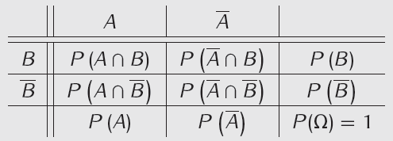
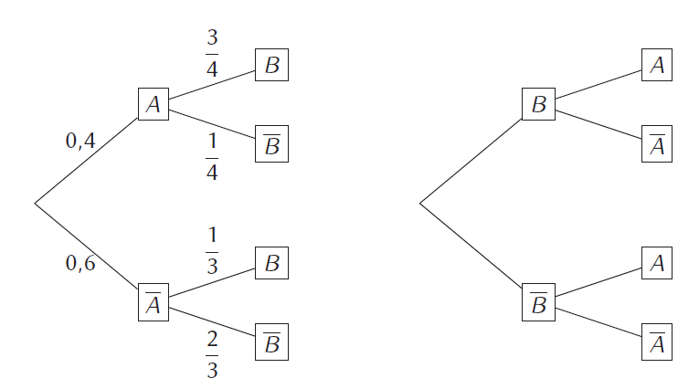
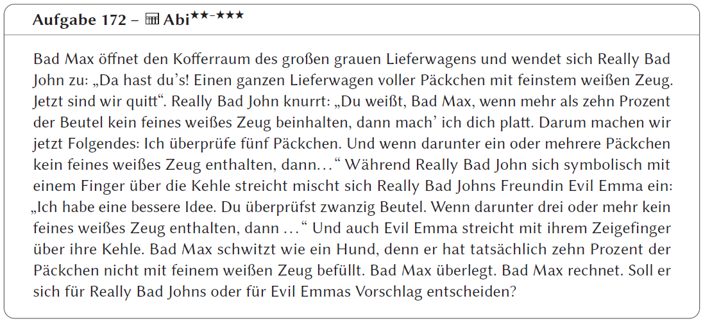
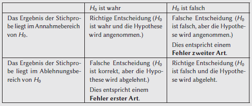

# Stochastik
- Grundlagen
- Bedingte Wahrscheinlichkeiten und Baumdiagramme
- Erwartungswert, Varianz und Standardabweichung
- Binomialkoeffizient
- Binomialverteilung
- 3M-Aufgaben
- Hypothesentests

---
<!--footer: Abiturma Abivorbereitungskurs | Winter 2023 München | Vinzenz Männig-->
<!--header: Grundlagen-->
### Grundlagen
- Ergebnis: Ausgangsmöglichkeit eines Zufallsexperiments
- Ergebnismenge $\Omega$: Menge aller Ergebnisse
- Ereignis: Teilmenge von $\Omega$ (Teilmenge bedeutet entweder keines, eines oder viele Elemente aus einer anderen Menge)
- Mächtigkeit $|A|$: Anzahl der Elemente in der Menge $A$
- Gegenereignis $\overline A$: Menge aller Ergebnisse, die nicht in $A$ enthalten sind
- $𝑃(\overline A)=1−𝑃(A)$
- Bei Ereignissen der Art „mindestens ein…“ ist es fast immer leichter, die Wahrscheinlichkeit über das Gegenereignis zu bestimmen!

---
##### Laplace-Experiment
$P(A) = \frac{|Günstige Ergebnisse|}{|Alle Ergebnisse|} = \frac{|A|}{|\Omega|}$

- Würfeln, Glücksrad mit gleich großen Sektoren drehen, alle Zufallsexperimente, wo alle Ergebnisse die selbe Wahrscheinlichkeit haben

Beispiel: Wahrscheinlichkeit eine gerade Augenzahl zu würfeln
$P(gerade Augenzahl) = \frac{3}{6}$

---
##### Rechnen mit Wahrscheinlichkeiten
Schnitt $A \cap B$ ("und"), Vereinigung $A \cup B$ ("oder")
&nbsp;

Satz von Sylvester: $P(A\cup B) = P(A) + P(B) - P(A \cap B)$
&nbsp;

Regeln von De Morgan:
$\overline{A\cup B} = \qquad \qquad \qquad \overline{A\cap B}=$

Stochastische Unabhängigkeit:
A, B unabhängig $\Leftrightarrow P(A\cap B) = P(A) \cdot P(B)$

Berechne $P(A\cap B)$, dann berechne $P(A) \cdot P(B)$, schließlich: Gilt $P(A\cap B) = P(A) \cdot P(B)$?
$P(A\cap B) = P(A) \cdot P(B)$ gilt nur bei Unabhängigkeit!

---
##### Vierfeldertafel
Vergleich von zwei binären Ereignissen
Beispiel: In einer Schulklasse gibt es 12 weibliche und 8 männliche Schüler. Zwei Jungs sind Raucher. Insgesamt raucht ein Fünftel aller Schüler dieser Klasse.

---
### Grundlagen: Rechenblock

| Schwierigkeit | Aufgaben |
| ----------- | ----------- |
| leicht | 162, 163, 164, 165 |
| mittel | 166, 168, 169, 170 |
| schwer | 167 |

Für Schnelle und Unterforderte: 
- Aufgaben 205 ff.

---

---

---
<!--header: Bedingte Wahrscheinlichkeiten und Baumdiagramme-->
### Bedingte Wahrscheinlichkeiten und Baumdiagramme
$P_B(A) = P(A|B)=\frac{P(A\cap B)}{P(B)}$

##### Rezept
Beispiel: In einer Schulklasse befinden sich 10 Jungen und 15 Mädchen. Dabei sind 4 Jungs und 3 Mädchen blond. Bestimme die Wahrscheinlichkeit dafür, dass ein zufällig ausgewählter Junge blond ist.
1. Teilwahrscheinlichkeiten berechnen/auslesen
&nbsp;
&nbsp;

2. Formel anwenden

---
##### Baumdiagram zeichnen
- Die Wahrscheinlichkeit eines Pfades ist das Produkt der Einzelwahrscheinlichkeiten
- Die Gesamtwahrscheinlichkeit eines Ereignisses ist die Summe der Wahrscheinlichkeiten aller günstigen Pfade.

---
Weiteres Beispiel: In einer Urne befinden sich zwei weiße und zwei schwarze Kugeln. Es werden nacheinander zwei Kugeln ohne Zurücklegen gezogen. Was ist die Wahrscheinlichkeit zwei unteschiedliche Kugeln zu ziehen?

---
##### Ziehen mit und ohne zurücklegen
- Ziehen mit Zurücklegen: Die Kugeln nach dem Ziehen zurückgelegt, die Wahrscheinlichkeiten verändern sich nicht. Die Äste des Baumdiagramms sehen in
jeder Ebene gleich aus. Die Ereignisse auf verschiedenen Ebenen sind stochastisch unabhängig voneinander.
- Ziehen ohne Zurücklegen: Werden die Kugeln nicht zurückgelegt, so verändern sich die Wahrscheinlichkeiten. Die Anzahl aller Möglichkeiten verringert sich pro Ebene um eins. Entsprechend des vorherigen Zuges verändert sich auch die Anzahl der günstigen Möglichkeiten. Die Ereignisse der verschiedenen Ebenen sind daher stochastisch abhängig voneinander.

---
##### Stochastische Abhängigkeit erkennen
Am Baumdiagramm kann man ebenfalls erkennen, ob die Ereignisse A und B unabhängig sind, falls gilt: $𝑃_𝐴(𝐵)=𝑃_{\overline A}(𝐵)$

##### Abhängigkeit umdrehen
$P_B(A)=\frac{P(A\cap B)}{P(B)}$
$P_A(B)=\frac{P(A\cap B)}{P(A)} = \frac{P(A\cap B)}{P(A\cap B) + P(A\cap {\overline B})}$
da $P(A)= P(A\cap B) + P(A\cap {\overline B})$

---
##### Satz von Bayes (NICHT Abirelevant, aber spannend)
$P_B(A)=\frac{P(A\cap B)}{P(B)} \implies P(A\cap B) = P_B(A)P(B)$
$P_A(B)=\frac{P(A\cap B)}{P(A)}$

Einsetzen:
$P_A(B)=\frac{P_B(A)P(B)}{P(A)}$

Die bedingte Wahrscheinlichkeit kann also ganz einfach umgedreht werden!

---
##### Aufgabe 175

---
##### Bedingte Wahrscheinlichkeit vs Schnitt erkennen
Die Wahrscheinlichkeit ...
- ... dass jemand ein rauchender Junge ist
- ... dass ein Junge raucht
- ... dass ein Raucher ein Junge ist
- ... einen Jungen zu erwischen, der raucht
- ... unter den Nichtrauchern einen Jungen zu erwischen
- ... ein rauchendes Mädchen zu treffen
- ... dass ein zufällig ausgewähltes Mädchen nicht raucht
- ... eine Person raucht und ist ein Junge
- ... eine zufällig ausgewählte Person, die ein Junge ist, raucht

---
### Bedingte Wahrscheinlichkeiten und Baumdiagramme: Rechenblock

| Schwierigkeit | Aufgaben |
| ----------- | ----------- |
| leicht |  |
| mittel | 171, 172, 173 |
| schwer | 174 |

Für Schnelle und Unterforderte: 
- Aufgaben 205 ff.

---

---

---
<!--header: Erwartungswert, Varianz und Standardabweichung-->
### Erwartungswert, Varianz und Standardabweichung
##### Zufallsvariablen
- Eine Zufallsvariable ordnet allen Ergebnissen des Experiments reelle Zahlen zu
- Man schreibt daher für die Wahrscheinlichkeit eines Ergebnisses $P(X = x_1) = p_1$. Die Variable X ist hierbei die Zufallsvariable. Die Wahrscheinlichkeit, dass das Ergebnis $x_1$ auftritt, liegt bei $p_1$.
- Die Verteilung derWahrscheinlichkeiten $p_1,p_2,...$ auf die Ergebnisse $x_1, x_2,...$ nennt man Wahrscheinlichkeitsverteilung.

---
##### Beispiel Glücksrad
- Drei Sektoren, einer davon ist genau 1° und ein zweiter 29° groß
- Gewinn: kleinster Sektor 100€, 29°-Sektor 10€, Rest 0€
X: Gewinn in Euro, $X \in \{0,10,100\}$
$p_1: P(X = x_1) =P(X = 0) =\frac{330}{360}$
$p_2 : P(X = x_2) =P(X = 10) =\frac{29}{360}$
$p_3 : P(X = x_3) =P(X = 100) =\frac{1}{360}$

---
##### Erwartungwert (Mittelwert)
- Den Mittelwert, den man erhält, wenn man das Experiment oft durchführt, nennt man Erwartungswert E(X). Es ist der Wert, den man durchschnittlich erwartet.

$E(X) = x_1 · P(X = x_1) + x_2 · P(X = x_2) + . . . + x_n · P(X = x_n)$
- Der Erwartungswert E(X) muss kein Wert sein, den X auch tatsächlich annimmt.
- Ein Spiel ist fair, wenn E(X) dem Einsatz entspricht.

---
##### Erwartungswert beim Würfeln (d6)
$E(X) = 1 · P(X = 1) + 2 · P(X = 2) + ... + 6 · P(X = 6) =$
$1\cdot\frac{1}{6}+2\cdot\frac{1}{6}+3\cdot\frac{1}{6}+4\cdot\frac{1}{6}+5\cdot\frac{1}{6}+6\cdot\frac{1}{6} = 3.5$

##### Rezept: Ist ein Spiel fair?
1. Bestimme den Erwartungswert des Gewinns
2. Vergleiche den zu erwartenden Gewinn mit dem Einsatz

---
##### Varianz
- Die Streuung einer Zufallsvariable X um ihren Erwartungswert $E[X]$ wird Varianz $Var[X]$

$Var[X] = (E[X] - x_1)^2 · P(X = x_1) + (E[X] - x_2)^2 ·$
$\quad P(X = x_2) + · · · + (E[X] - x_n)^2 · P(X = x_n)$

- Standardabweichung $\sigma$

$\sigma(X) = \sqrt{Var[X]}$

---
##### Varianz beim Würfeln
$Var[X] = (E[X] - x_1)^2 · P(X = x_1) + (E[X] - x_2)^2 ·$
$\quad P(X = x_2) + · · · + (E[X] - x_n)^2 · P(X = x_n)=$
$Var[X] = (3.5 - 1)^2 · \frac{1}{6} + (3.5 - 2)^2 · \frac{1}{6} + (3.5 - 3)^2 · \frac{1}{6} +$
$\quad (3.5 - 4)^2 · \frac{1}{6} + (3.5 - 5)^2 · \frac{1}{6} + (3.5 - 6)^2 · \frac{1}{6}=$
$=2.92$

$\sigma(X) = \sqrt{Var[X]} = \sqrt{2.92} = 1.71$

---
### Erwartungswert, Varianz und Standardabweichung: Rechenblock

| Schwierigkeit | Aufgaben |
| ----------- | ----------- |
| leicht | 179, 182 |
| mittel | 181 |
| schwer | 180 |

Für Schnelle und Unterforderte:
- Aufgaben 205 ff.

---
<!--header: Kombinatorik und Binomialkoeffizient-->
### Kombinatorik: Wie viele Möglichkeiten gibt es?
##### Mit Reihenfolge, mit Zurücklegen
z.B PIN-Code, Fahrradschloss, Passwörter

n ist die Anzahl an Möglichkeiten (z.B Zahlen am Schloss), k sagt wie oft aus den Möglichkeiten gewählt wird (z.B Vier Zahlen)

$N = n^k$

Beispiel: Schloss mit 5 Zahlen
$N = 10^5 = 100000$

---
##### Mit Reihenfolge, ohne Zurücklegen
z.B Menschen auf Stühle anordnen

Beispiel: 5 Personen nehmen auf 5 Stühlen platz
$N = 5 \cdot 4 \cdot 3 \cdot 2 \cdot 1 = 5! = 120$

Beispiel: 3 Personen nehmen auf 5 Stühlen platz
$N = 5 \cdot 4 \cdot 3 = \frac{5 \cdot 4 \cdot 3 \cdot 2 \cdot 1}{ 2 \cdot 1} = \frac{5!}{2!} = 60$

Allgemein: n ist die Anzahl an Möglichkeiten (z.B Zahlen am Schloss), k sagt wie oft aus den Möglichkeiten gewählt wird (z.B Vier Zahlen)

$N = \frac{n!}{(n-k)!}$

---
Wenn es etwas komplizierter wird: Immer vorstellen mit: Menschen gehen in einen Raum, wie viele Plätze sind noch frei? Immer zuerst die Menschen mit den meisten Einschränkungen in den Raum "schicken".

Beipiel: Talkshow; Ein Moderator in der Mitte, eine Journalistin, die neben dem Moderator sitzen will, ein Ehepaar, das zusammen sitzen will, ein Manager, dem es egal ist

---
##### Ohne Reihenfolge, ohne Zurücklegen

Beispiel: 3 Personen nehmen auf 5 Stühlen platz
$N = 5 \cdot 4 \cdot 3 = \frac{5 \cdot 4 \cdot 3 \cdot 2 \cdot 1}{ 2 \cdot 1} = \frac{5!}{2!} = 60$
Problem: Wenn wir eineiige Drillinge habe, können wir sie eh nicht unterscheiden! 60 beinhaltet auch Permutationen der Drillinge!

&nbsp;
&nbsp;
&nbsp;
&nbsp;

$N = \frac{5 \cdot 4 \cdot 3}{3 \cdot 2 \cdot 1} = \frac{5 \cdot 4 \cdot 3 \cdot 2 \cdot 1}{ 2 \cdot 1 \cdot 3 \cdot 2 \cdot 1} = \frac{5!}{2! \cdot 3!} = 10$

$N = \frac{n!}{(n-k)! \cdot k!} = \begin{pmatrix}n \\ k\end{pmatrix} \implies$ Binomialkoeffizient

---
Beispiel: Peter besitzt 6 Pullover. Von diesen möchte er 2 mit in den Urlaub nehmen. Wie viele verschiedene Möglichkeiten für seine Wahl gibt es?

---
##### Rechenregeln für Binomialkoeffizienten
Nicht um bedingt relevant, tragen aber zum Verständnis bei!
$\begin{pmatrix}n \\ 0\end{pmatrix}= \begin{pmatrix}n \\ n\end{pmatrix}=1$
$\begin{pmatrix}n \\ n-k\end{pmatrix}= \begin{pmatrix}n \\ k\end{pmatrix}$

---
### Kombinatorik und Binomialkoeffizient: Rechenblock

| Schwierigkeit | Aufgaben |
| ----------- | ----------- |
| leicht |  |
| mittel | 183, 184 |
| schwer |  |

Für Schnelle und Unterforderte:
- Aufgaben 205 ff.

---
<!--header: Binomialverteilung-->
### Binomialverteilung
Eigenschaften einer Binomialverteilung:
- Es gibt ein Experiment mit nur zwei möglichen Ergebnissen
- Das Experiment wird insgesamt n Mal durchgeführt
- Die Wahrscheinlichkeit, einen Treffer zu erzielen, beträgt p und bleibt bei jeder Durchführung gleich
- Gesucht ist die Wahrscheinlichkeit, eine vorgegebene Anzahl an Treffern zu erzielen, diese wird mit k bezeichnet. Somit ist die Reihenfolge egal

---
##### Werfen einer Münze
Eine Münze wird 5 Mal geworfen. Wie hoch ist die Wahrscheinlichkeit, dass genau 3 Mal *hintereinander* Kopf fällt, und dann 2 Mal *hintereinander* Zahl? Die Wahrscheinlichkeit für Kopf ist $P(K) = 0.4$
Somit: n = 5, p = 0.4, k = 3

$P(KKKZZ) = 0.4 \cdot 0.4 \cdot 0.4 \cdot 0.6 \cdot 0.6 = 0.4^3 \cdot 0.6^2 =$ $=p^k \cdot (1-p)^{n-k}$

Hier ist die Reihenfolge noch wichtig!

---
Eine Münze wird 5 Mal geworfen. Wie hoch ist die Wahrscheinlichkeit, dass genau 3 Mal Kopf fällt? Die Wahrscheinlichkeit für Kopf ist $P(K) = 0.4$
Somit: n = 5, p = 0.4, k = 3

$P(3K)=P(KKKZZ)+P(KKZKZ)+P(KZKKZ)+...$

$P(KKKZZ)=P(KKZKZ)=0.4^3 \cdot 0.6^2$

$P(3K)=N \cdot P(KKKZZ) = N \cdot p^k \cdot (1-p)^{n-k}$

Was ist N? N ist der Binomialkoeffizient!

$B(n;p;k) = \begin{pmatrix}n \\ k\end{pmatrix} \cdot p^k \cdot (1-p)^{n-k}$

$E[X] = n \cdot p, \quad Var[X] = n · p · (1 - p)$

---
### Kumulierten Binomialverteilung
##### Fall 1: Höchstens
Bisher: Genau k Treffer
Jetzt: höchstens / mindestens k Treffer

Eine Münze wird 5 Mal geworfen. Wie hoch ist die Wahrscheinlichkeit, dass *höchstens* 2 Mal Kopf fällt? Die Wahrscheinlichkeit für Kopf ist $P(K) = 0.4$
Somit: n = 5, p = 0.4, k $\leq$ 2

$F(5;0.4;k\leq 2) = B(5;0.4;0)+B(5;0.4;1)+B(5;0.4;2)$

---
##### Fall 2: Mindestens
Kumuliert funktioniert nur mit *mindestens*. Höchstens muss mit dem Gegenereignis in mindestens umgeformt werden.

Eine Münze wird 5 Mal geworfen. Wie hoch ist die Wahrscheinlichkeit, dass *höchstens* 2 Mal Kopf fällt? Die Wahrscheinlichkeit für Kopf ist $P(K) = 0.4$
Somit: n = 5, p = 0.4, k $\geq$ 2

$F(5;0.4;k\geq 2) = 1 - F(5;0.4;k\leq 1)$

---
##### Fall 3: Höchstens und Mindestens
Eine Münze wird 5 Mal geworfen. Wie hoch ist die Wahrscheinlichkeit, dass *mindestens* 2 Mal, aber *höchstens* 4 Mal Kopf fällt? Die Wahrscheinlichkeit für Kopf ist $P(K) = 0.4$
Somit: n = 5, p = 0.4, $2 \leq k \leq 4$

$F(5;0.4;2 \leq k \leq 4) = F(5;0.4;k\leq 4) - F(5;0.4;k\leq 1)$

---
### Binomialverteilung: Rechenblock

| Schwierigkeit | Aufgaben |
| ----------- | ----------- |
| leicht | 187, 194 |
| mittel | 188, 189, 190, 195, 196 |
| schwer | 191, 193, 197, 198, 199 |

---
<!--header: 3M-Aufgaben-->
### 3M-Aufgaben
##### Rezept mit Beispiel Typ 1
Bei einem Glücksspiel gewinnt man mit einer Chance von 5%. Wie oft muss man mindestens spielen, um mit einer Wahrscheinlichkeit von mindestens 99 % mindestens einmal zu gewinnen?
1. Aufgabe als Ungleichung schreiben
P(min. 1 Treffer)$\geq 0.99$
2. Ins Gegenereignis umschreiben (kleiner gleich notwendig)
P(kein Treffer)$\leq 0.01$
3. Berechne die Wahrscheinlichkeit des Gegenereignisses
P(kein Treffer)$= \begin{pmatrix}n \\ 0\end{pmatrix} \cdot 0.05^0 \cdot (1-0.05)^n = (0.95)^n$

---
4. In Ungleichung einsetzen
$(0.95)^n\leq 0.01 \qquad |\log_{0.95}$
$n \geq log_{0.95}(0.01) = 89.78$
Also mindestens 90 Mal

Reminder: Beim Multiplikation und Division mit negativen Zahlen muss das Ungleichheitszeichen umgedreht werden! Gleiches gilt für Logarithmen zu einer Basis kleiner als 1 (da der ln von Zahlen kleiner als eins negativ ist!)

---
##### Rezept mit Beispiel Typ 2
Bei einem Glücksspiel wird 100 Mal gespielt. Wie hoch muss die Gewinnwahrscheinlichkeit in Prozent auf zwei Dezimalen genau mindestens sein, um mit einer Wahrscheinlichkeit von mindestens 95 % mindestens einmal zu gewinnen?
1. Aufgabe als Ungleichung schreiben
P(min. 1 Treffer)$\geq 0.95$
2. Ins Gegenereignis umschreiben (kleiner gleich notwendig)
P(kein Treffer)$\leq 0.05$
3. Berechne die Wahrscheinlichkeit des Gegenereignisses
P(kein Treffer)$= \begin{pmatrix}100 \\ 0\end{pmatrix} \cdot p^0 \cdot (1-p)^{100} = (1-p)^{100}$

---
4. In Ungleichung einsetzen
$(1-p)^{100}\leq 0.05 \qquad |\sqrt[100]{}$
$1-p\leq \sqrt[100]{0.05} \qquad |-1$
$-p\leq \sqrt[100]{0.05}-1 \qquad |\cdot(-1)$
$p\geq 1-\sqrt[100]{0.05} =0.030$

---
### 3M-Aufgaben: Rechenblock

| Schwierigkeit | Aufgaben |
| ----------- | ----------- |
| leicht |  |
| mittel | 200, 201, 202 |
| schwer |  |

Für Schnelle und Unterforderte:
- Aufgaben 205 ff.

---
<!--header: Hypothesentests-->
### Hypothesentests
Eine Hypothese $H_0$ (Nullhypothese) ist eine Behauptung, die aufgrund einer Beobachtung abgelehnt oder angenommen werden soll.

---
##### Fehler 1. Art berechnen
Fall 1: $H_0 : p\geq p_0$ (Linkseitiger Hypothesentest). Dann gilt:
$\alpha = P(X \leq k)$
Fall 2: $H_0 : p\leq p_0$ (Rechtsseitiger Hypothesentest). Dann gilt: $\alpha = P(X ≥ k) = 1 - P(X ≤ k - 1)$

---
Bevor ein Großkunde eine sehr große Menge an Schokoladentafeln abnimmt, wird die Hypothese $H_0$ (Weniger als 10 % der Schokoladentafeln sind beschädigt)
getestet. Hierzu wird folgende Entscheidungsregel festgesetzt: Es werden 10 Tafeln gesichtet. Werden darunter 2 oder mehr Tafeln als fehlerhaft bemerkt, wird die $H_0$-Hypothese abgelehnt und der Kauf findet nicht statt. Bestimme die Wahrscheinlichkeit eines Fehlers 1. Art.
- $H_0$ : p ≤ 0,1 (Rechtsseitiger Hypothesentest mit $p_0$ = 0,1)
- n = 10 (Stichprobenlänge)
- k = 2 (Entscheidungsregel: Ab k = 2 wird H0 abgelehnt.)

- Gesucht: α (Irrtumswahrscheinlichkeit, Wahrscheinlichkeit für Fehler 1. Art.)

---
α = P(X ≥ 2) = 1 - P(X ≤ 1)
= 1 - P (0 oder 1 Tafel sind nicht ok)
= 1 - $\left(\begin{pmatrix}10 \\ 0\end{pmatrix} \cdot 0.1^0 \cdot 0.9^{10} + \begin{pmatrix}10 \\ 1\end{pmatrix} \cdot 0.1^1 \cdot 0.9^{9}\right) =0.26$

---
### Hypothesentests: Rechenblock

| Schwierigkeit | Aufgaben |
| ----------- | ----------- |
| leicht |  |
| mittel | 203, 204 |
| schwer |  |

Für Schnelle und Unterforderte:
- Aufgaben 205 ff.

---