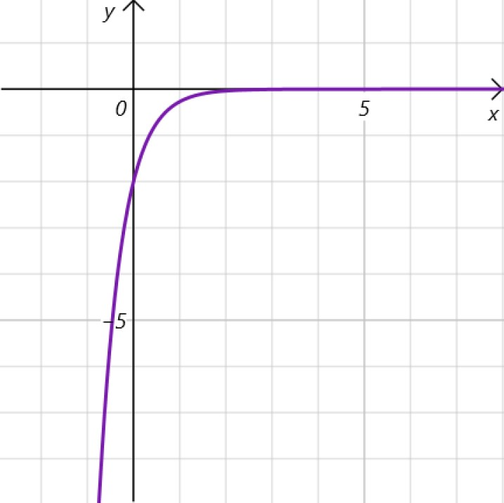

# Willkommen zu Tag 3!
Abiturma/Abicrash Abivorbereitungskurs
Fasching 2024 München
Vinzenz Männig

---
<!--header: Wiederholung Tag 2-->
<!--footer: Abiturma/Abicrash Abivorbereitungskurs | Fasching 2024 München | Vinzenz Männig-->

1. $f(x) = -x^5 + x^3 +2$
2. $g(x) = -2x^5 + 2$
3. $h(x) = -x^3 + 1$

---

1. $f(x) = \mathrm e ^{-x^2}$
2. $g(x) = - \mathrm e ^{-x}$
3. $h(x) = -2 \mathrm e ^{-2x}$

---
##### Gleichungen
$\mathrm e ^{2x} + \mathrm e ^{5x} = 3 \mathrm e ^{2x}, \quad \mathrm e ^{6x} + \mathrm e ^{3x} = 4- \mathrm e ^{6x} - \mathrm e ^{3x}$

##### Ableiten
$f(x) = \sin (\mathrm e ^{x^2-2}), \quad g(x) = \frac{\ln (-x)}{24}, \quad h(x) = x^2+x+\sqrt{\ln x}$

##### Bestimme alle Asymptoten
$f(x) = \frac{5x^2+2x-7}{x}, \quad g(x) = \frac{2x^2(4-x)}{x^3(x+2)}$

##### Kurvendiskussion (Definitionsbereich, Achsenschnittpunkte, Symmetrie, Extrempunkte, Wendepunkte, Verhalten im Unendlichen)
$f(x) = x^2 + 4x -12, \quad g(x) = e^{x^2}-1$

---
##### Lösungen
$\mathrm e ^{2x} + \mathrm e ^{5x} = 3 \mathrm e ^{2x} \implies x = \frac{ln 2}{3}$
$\mathrm e ^{6x} + \mathrm e ^{3x} = 4- \mathrm e ^{6x} - \mathrm e ^{3x} \implies x = 0$

$f(x) = \sin (\mathrm e ^{x^2-2}) \implies f^\prime(x) = \cos(\mathrm e ^{x^2-2}) \cdot \mathrm e ^{x^2-2} \cdot (2x)$
$g(x) = \frac{\ln (-x)}{24} \implies g^\prime(x) = \frac{1}{24x}$
$h(x) = x^2+x+\sqrt{\ln x} \implies h^\prime(x) = 2x+1+\frac{1}{2x}(\ln x)^{-\frac{1}{2}}$

$f(x) = \frac{5x^2+2x-7}{x} \implies$ waagrecht: $x = 0$, schräg: $y = 5x+2$
$g(x) = \frac{2x^2(4-x)}{x^3(x+2)} \implies$ waagrecht: $x_1 = 0, x_2 = -2$, waagrecht: $y = 0$

---
$f(x) = x^2 + 4x -12$
- Definitionsbereich: $\mathcal{D} = \mathbb{R}$
- Achsenschnittpunkte: $P_1(0|-12), P_2(-6|0), P_3(2|0)$
- Symmetrie: Keine
- Extrempunkte: $TP(-2|-16)$
- Wendepunkte: Keine
- Verhalten im Unendlichen: 
$\lim \limits_{x \to +\infty} = +\infty, \quad \lim \limits_{x \to -\infty} = +\infty$

---
$g(x) = e^{x^2}-1$
- Definitionsbereich: $\mathcal{D} = \mathbb{R}$
- Achsenschnittpunkte: $P_1(0|0)$
- Symmetrie: Achsensymmetrisch
- Extrempunkte: $TP(0|0)$
- Wendepunkte: Keine
- Verhalten im Unendlichen:
$\lim \limits_{x \to +\infty} = +\infty, \quad \lim \limits_{x \to -\infty} = +\infty$