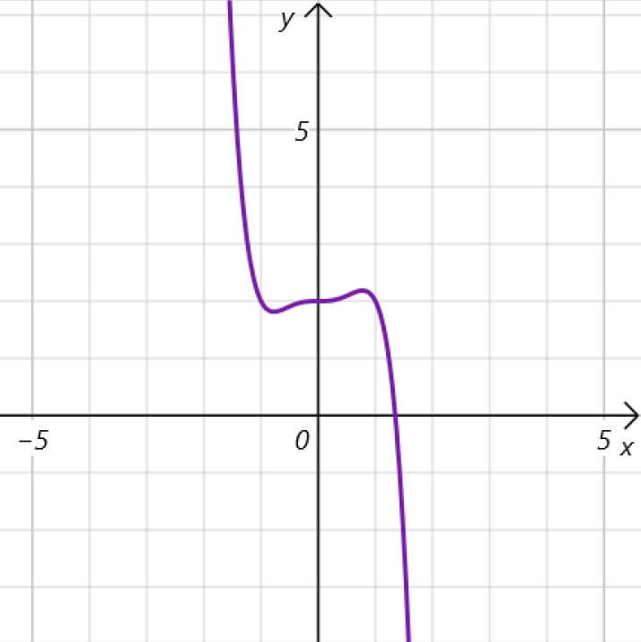
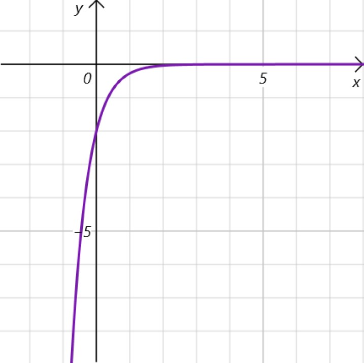

# Willkommen zu Tag 3!
Abiturma/Abicrash Abivorbereitungskurs
Fasching 2024 München
Vinzenz Männig

---
<!--header: Wiederholung Tag 2-->
<!--footer: Abiturma/Abicrash Abivorbereitungskurs | Fasching 2024 München | Vinzenz Männig-->

1. $f(x) = -x^5 + x^3 +2$
2. $g(x) = -2x^5 + 2$
3. $h(x) = -x^3 + 1$

---

1. $f(x) = \mathrm e ^{-x^2}$
2. $g(x) = - \mathrm e ^{-x}$
3. $h(x) = -2 \mathrm e ^{-2x}$

---
##### Ableiten
$f(x) = x^2+x^3+\cos x, \quad g(x) = \mathrm e ^{3x^2+\sin x}, \quad h(x) = x^2 \mathrm e ^x$

##### Gleichungen
$\mathrm e ^{2x} + \mathrm e ^{5x} = 3 \mathrm e ^{2x}, \quad \mathrm e ^{6x} + \mathrm e ^{3x} = 4- \mathrm e ^{6x} - \mathrm e ^{3x}$

##### Ableiten
$f(x) = \sin (\mathrm e ^{x^2-2}), \quad g(x) = \frac{\ln (-x)}{24}, \quad h(x) = x^2+x+\sqrt{\ln x}$

---
##### Lösungen
$f(x) = x^2+x^3+\cos x \implies f^\prime (x) = 2x + 3x^2 - \sin x$
$g(x) = \mathrm e ^{3x^2+\sin x} \implies g^\prime (x) = \mathrm e ^{3x^2+\sin x} \cdot (6x + \cos x)$
$h(x) = x^2 \mathrm e ^x \implies h^\prime (x) = (x+2)x \mathrm e ^x$

$\mathrm e ^{2x} + \mathrm e ^{5x} = 3 \mathrm e ^{2x} \implies x = \frac{ln 2}{3}$
$\mathrm e ^{6x} + \mathrm e ^{3x} = 4- \mathrm e ^{6x} - \mathrm e ^{3x} \implies x = 0$

$f(x) = \sin (\mathrm e ^{x^2-2}) \implies f^\prime(x) = \cos(\mathrm e ^{x^2-2}) \cdot \mathrm e ^{x^2-2} \cdot (2x)$
$g(x) = \frac{\ln (-x)}{24} \implies g^\prime(x) = \frac{1}{24x}$
$h(x) = x^2+x+\sqrt{\ln x} \implies h^\prime(x) = 2x+1+\frac{1}{2x}(\ln x)^{-\frac{1}{2}}$

---

---

---